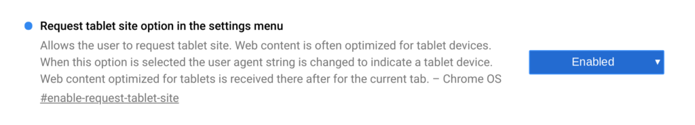
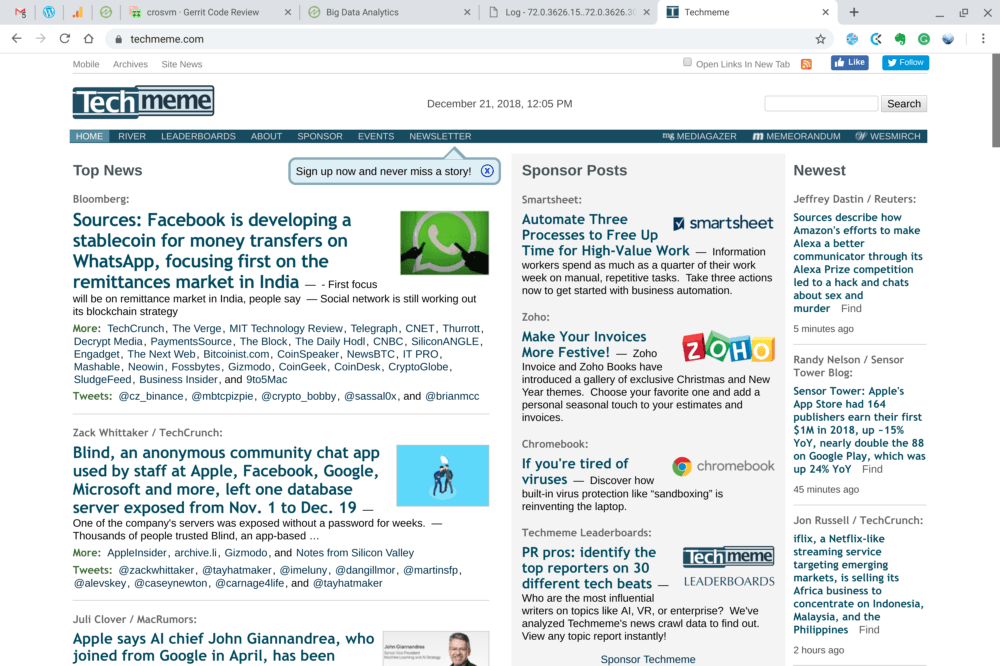
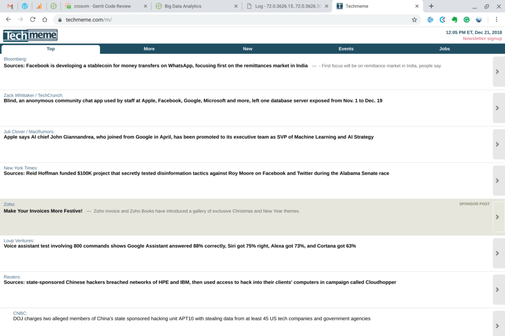

Last month we heard that [Google would be adding a mobile-friendly web page view to Chrome OS devices](https://www.aboutchromebooks.com/news/virtual-desktop-workspaces-and-mobile-website-views-coming-to-chromebooks-and-chrome-tablets/) and the feature is now available in the latest Dev Channel update for Chrome OS 72. The idea here is to provide the option of a mobile page view on tablets if the user desires it, making the user experience a bit better for touchscreen-only devices such as the Pixel Slate.

To add the feature, you obviously need to be on the latest Dev Channel of Chrome OS -- [here's how to get there](https://www.aboutchromebooks.com/qa/whats-the-difference-between-developer-mode-and-the-dev-channel-on-a-chromebook/) -- and then enable the following flag: _chrome://flags/#enable-request-tablet-site_. Once enabled, restart your device and you'll have the feature.

To use it, just hit the three dot Chrome menu at the top right of your browser when viewing any desktop web page. At the bottom of the options list, you'll see a "Request tablet site" option. Tap it and if there's a mobile-formatted version of the site you're viewing, the page should reload with the same view you'd see on an Android phone.

Here's a standard desktop view of Techmeme, for example, followed by the same page after requesting the tablet site.

When word of this feature first became known, I suggested that it would be [more effective for Chrome tablets with smaller screens](https://www.aboutchromebooks.com/news/virtual-desktop-workspaces-and-mobile-website-views-coming-to-chromebooks-and-chrome-tablets/), such as the 9.7-inch Acer Chromebook Tab 10. After using it for a bit on my 12.3-inch Pixel Slate, I feel the same way. Even more so.

With a large display, there's less need for a mobile formatted web page, both from an information density and touch target standpoint; especially if you have a keyboard accessory with a generously sized trackpad at the ready. Even when in slate mode without the keyboard, I haven't yet found a site that wasn't easy to navigate with the Pixel Slate's touchscreen.

As a result, I'll likely never use this function. For device owners with a smaller display -- and I expect that the Acer Chromebook Tab 10 won't be the only small Chrome tablet on the market for long -- this is a great option to have.

Note that the Dev Channel of Chrome OS is a work in progress, so you may encounter bugs that you haven't see on the Stable Channel. And if you go back from the Dev Channel to the Stable Channel, there's a good chance that all of your local data will be lost due to a Chrome OS Powerwash reset.
