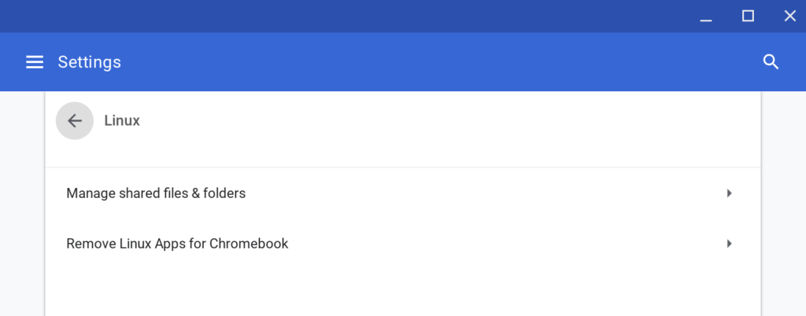
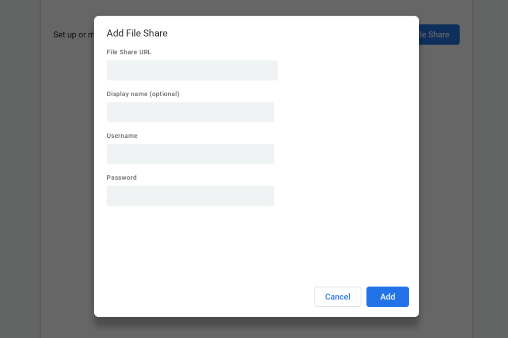

Earlier this week, [Google released the Dev Channel version of Chrome OS 72](https://chromereleases.googleblog.com/2018/11/dev-channel-update-for-chrome-os_12.html) and I had planned to write up some of the new features and fixes. That was 48 hours ago and here I am today.

Why? Because [the list of changes in this version was simply massive](https://chromium.googlesource.com/chromium/src/+log/72.0.3593.0..72.0.3602.0?pretty=fuller&n=10000), and by "list" I mean the very limited descriptions plus the actual code changes. It's taken me this long to get through everything in the changelog!

Of course, not all of the changes are visual or meaningful in a way that will have obvious benefits. Many are simple fixes or minor tweaks -- yes, even code with corrected typos counts as a change -- so here are some of the more impactful ones that I've read through and gathered.

The first few are implementations of features I've previously reported, including:

- An expansion of the ["Share with Linux" feature in the Chrome OS Files app](https://www.aboutchromebooks.com/news/project-crostini-chrome-os-files-share-with-linux/). Until now, you couldn't share a root folder, such as "Downloads"; [you can with this version](https://chromium.googlesource.com/chromium/src/+/918c5c99b7717dfc71617b38f2ea832472da63c7). 
- The ability to [install .deb packages from the Chrome OS Files app](https://chromium.googlesource.com/chromium/src/+/2e58032c7960fdd40ce5b2107761e78ab31bf474) without [moving the downloaded software to the Project Crostini Linux container](https://www.aboutchromebooks.com/news/install-linux-apps-chromebook-share-with-linux-files-for-project-crostini/). This will work by sharing the Chrome OS host folder with Linux.
- Prep work for the upcoming [USB support in Project Crostini](https://www.aboutchromebooks.com/news/project-crostini-linux-usb-support-chromebooks/). A new _[#crostini-usb-support](https://chromium.googlesource.com/chromium/src/+/918c5c99b7717dfc71617b38f2ea832472da63c7)_ flag will enable the feature when it arrives.
- [Icon prep work](https://chromium.googlesource.com/chromium/src/+/6e6edb882447e263323bd30e959ebbd37a7bf9b5) for supporting [shared Computers under Google Drive in the Files app](https://www.aboutchromebooks.com/news/project-crostini-share-google-drive-team-drives-computer-linux-chromebook/). Note that this change also says "_Still needs to support "USB and External Devices" after confirming with drive folks that this name will not be localized."_

The following are new, or at least new to me, features:

- Related to the "Share with Linux" feature, [when a parent folder is unshared, any children folders will no longer be shared](https://chromium.googlesource.com/chromium/src/+/09a1ec400631d7ea053a52b61ed9c13d04c8e963).
- [Adding a touchpad device](https://chromium.googlesource.com/chromium/src/+/65912b5f25a91182e6c31bb950e86b08c0ac9ce8) automatically enables clamshell (aka: desktop) mode. This function appears to already be enabled when attaching a mouse.
- Face detection functionality when using the Android Camera app to [better tune the image quality and exposure around a face](https://chromium.googlesource.com/chromium/src/+/39e147d616e41cd09dc334958a23d244e2f6d33e).
- The addition of a [most recently used share path](https://chromium.googlesource.com/chromium/src/+/41d82520fd4603048678f4e87cf391633e4a35cc) in the recently implemented [SMB file share feature](https://www.aboutchromebooks.com/news/chrome-os-70-hits-the-stable-channel-bringing-a-better-chrome-tablet-experience/) that arrived in Chrome OS 70. 
- [Disabling double-tap to zoom when in tablet mode](https://chromium.googlesource.com/chromium/src/+/be99356810f3abe65adb881e38a797ba93708d7a). I'm not sure why this is going away because it leaves users only with a pinch-to-zoom option.
- Make the _#enable-app-shortcut-search_ for Android shortcuts [on by default](https://chromium.googlesource.com/chromium/src/+/e6bd935ef544a615f0a70b3257f02f664c74a86e).

Again, there are a slew of changes, some I may have missed and some I purposely skipped in this update until I'm sure I fully understand their impact.

Needless to say, there's plenty of goodies to test in the Dev Channel release for Chrome OS! If you want to sneak an early peek at these and other new features, it's easy to [change over to the Dev Channel](https://www.aboutchromebooks.com/qa/whats-the-difference-between-developer-mode-and-the-dev-channel-on-a-chromebook/), but remember: You will likely see more bugs than on the Stable Channel. Additionally, if you switch back to a lower numbered version of Chrome OS, all local data on your device will be wiped out.
