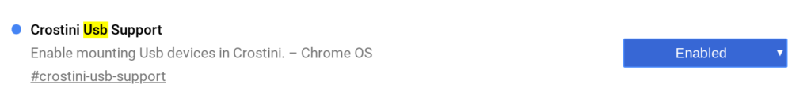
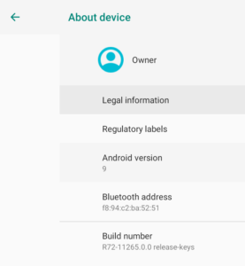

Well, that was quick. I just noted on Wednesday that [a major Chrome OS update for the Dev Channel brought a slew of new features](https://www.aboutchromebooks.com/news/chrome-os-72-dev-channel-preps-crostini-usb-support-easier-linux-package-installs-and-more/) and [now an update to version 72 brings even more](https://chromereleases.googleblog.com/2018/11/dev-channel-update-for-chrome-os_16.html). I'd argue that one of the most recent new features is among the most requested for those who run Linux apps on their Chromebook using Project Crostini: Support for USB devices in the Linux container.

Once your device is updated to Chrome OS 72.0.3609.3, you'll want to make sure you enable the _#crostini-usb-support_ flag, which will require a browser restart.

After that, insert a memory card into your Chromebook's card reader -- or in my case, an external card reader attached via USB-C on the Pixelbook -- and hop into your Files app. Right click on the SD card in Files and choose the ["Share to Linux" option](https://www.aboutchromebooks.com/news/project-crostini-chrome-os-files-share-with-linux/). My hope is that the manual sharing won't be required in the future.

Lastly, open up the Terminal app. There you should be able to navigate to _/mnt/chromeos/removable/\[name of SD card\]_ with the name of your memory card inserted where I have brackets; don't include the brackets.

Here you can see that I can view the contents of my SD card in the Linux Terminal, even creating a new directory called Test on it.

Now you can read or write to a memory card from within the Linux container, leaving just two more major features left to implement in Crostini: [GPU hardware acceleration](https://www.aboutchromebooks.com/news/project-crostini-progressing-towards-gpu-acceleration-for-chromebooks-running-linux-apps/) and audio support; both are in the works though.

Also in this version, unless it slipped by me in the last update, is an upgrade to Android 9.

Yes, Chromebooks are getting Android Pie before many actual Android phones.

This is one of the key benefits of having Google control the update process of Chrome OS devices: There are no carriers or other third-parties in between your machine and Android software updates.

It also means that as Android app developers add new features specific to the APIs in Android 9, you'll see them in Chrome OS. That also includes any Android functions Google adds.
