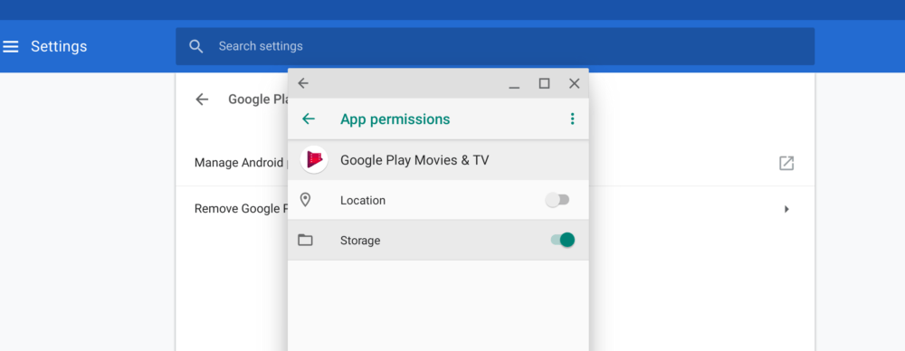
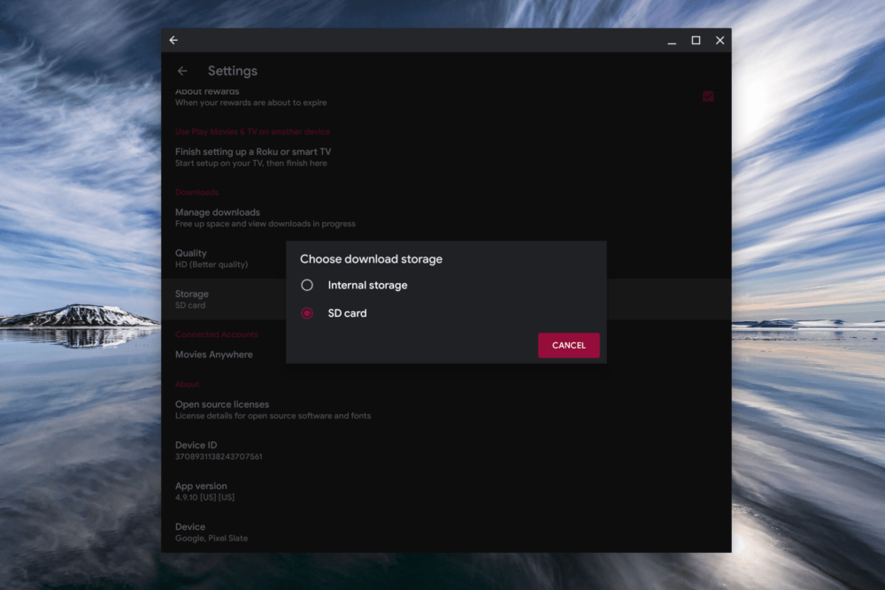
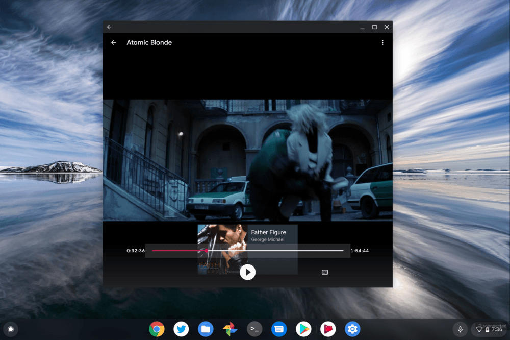
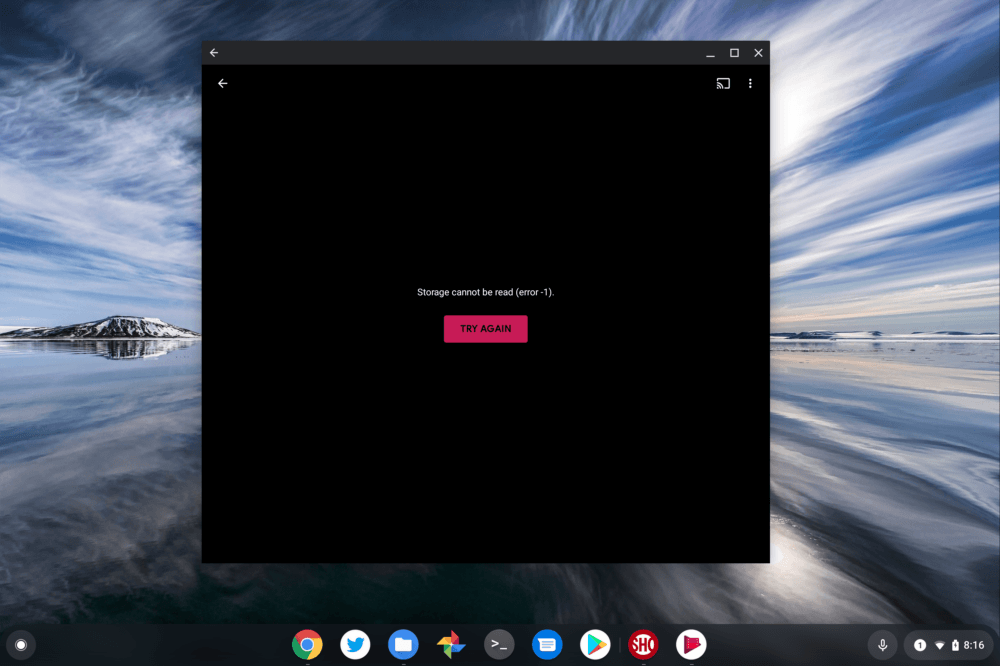
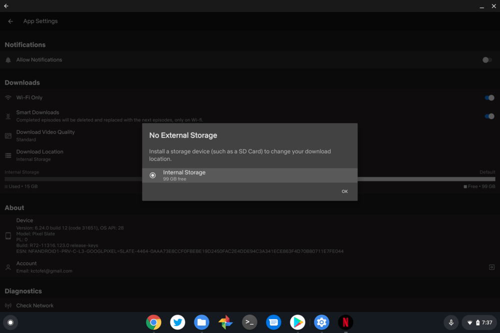

Last week, [Google released the Chrome OS 72 Stable Channel](https://www.aboutchromebooks.com/news/stable-version-chrome-os-72-what-you-need-to-know/) into the wild on a rolling schedule. As a result, my Pixel Slate just got the update. One of the included updates I noted is support for SD external storage support on Android apps. Yes, you can store finally media content from Android apps on your Chromebook with an SD card slot. **But there is one catch and one trick involved**.

<iframe style="width: 120px; height: 240px;" src="//ws-na.amazon-adsystem.com/widgets/q?ServiceVersion=20070822&amp;OneJS=1&amp;Operation=GetAdHtml&amp;MarketPlace=US&amp;source=ac&amp;ref=qf_sp_asin_til&amp;ad_type=product_link&amp;tracking_id=aboutchromebo-20&amp;marketplace=amazon&amp;region=US&amp;placement=B072268Q68&amp;asins=B072268Q68&amp;linkId=f5b8e75cef2f6dd4ef5bd8aec9f8d14c&amp;show_border=true&amp;link_opens_in_new_window=true&amp;price_color=333333&amp;title_color=0066c0&amp;bg_color=ffffff" frameborder="0" marginwidth="0" marginheight="0" scrolling="no" align="right"></iframe>

First, as [Google noted in the Chrome OS 72 release notes](https://chromereleases.googleblog.com/2019/02/stable-channel-update-for-chrome-os.html), this only works for "Android apps using direct /storage and MediaStore APIs." More on that in a minute. And second, I wasn't able to download content to the SD card in my Pixel Slate -- [via a USB-C hub](https://www.aboutchromebooks.com/news/the-best-home-and-travel-accessory-for-my-pixel-slate-is-this-usb-c-hub/) -- until I tweaked one setting in Android. Let me explain.

After the Chrome OS update, I immediately opened Google Play Movies, which is installed by default as an Android app on Chromebooks these days. I went to the app settings expecting to see the new option for offline storage on a memory card. **And it wasn't there**.

I thought that was odd because surely, Google itself would be meet the requirements for its own Android app to store media offline. Obviously, it does since you can download Play Movies to external storage on an Android phone. So what's the difference?

It turns out there is no difference, but instead, an app permission setting. And that makes sense if you think about it: Since Play Movies is preinstalled, you're not asked on a Chromebook to provide permission to external storage, or any other permissions, for that matter.

Luckily, this is easy to fix. I went into the Chrome OS Settings and navigated to the Google Play Store option, then choosing "Manage Android Preferences". This opens up the Android Settings app, just like on an Android phone. From there, I chose "Apps & Notifications", selected Google Play Movies and the Permissions option.

Sure enough, the Storage permission wasn't enabled.

Tapping it, as shown above, allows the app to have access to "Android" storage. A quick close and reopen of Google Play Movies then gave me the choice to download to either Internal Storage, which is the local Chromebook storage area, or External Storage, which is my memory card.

With the new SD Card option in Google Play Movies, I then successfully got a movie downloaded to the external storage. I was able to watch offline and scrub quickly to differenct scenes.

\[caption id="attachment\_2928" align="aligncenter" width="1000"\] Look, ma: No Wi-Fi!\[/caption\]

Just to check myself, after watching for a few minutes, I went back into the app permissions for Google Play Music and disabled the Storage permission. I then went to play the movie from where I paused it and, nope. That makes sense: The Android app no longer had access to the external card where I stored the movie.

I had to enable the same Storage permissions with the Spotify app to store playists on my SD card as well, so I'm thinking that at least in some cases, if not all, you may need to allow this permission on a per-app basis.

Now back to the matter of support for "Android apps using direct /storage and MediaStore APIs" because I think I already ran into one that doesn't quite meet this requirement: Netflix.

\[caption id="attachment\_2927" align="aligncenter" width="1000"\] As Seinfeld would say: "No external storage for you: Come back, one year!"\[/caption\]

I know that you can download Netflix titles to external storage on Android phones. But even allowing the storage permission for the app in the Android settings isn't doing the trick on my Pixel Slate. So at least for Netflix, this is still a no go, likely until the app is updated to allow it for Android apps on Chromebooks.

_**Update**: Per Steven's comment below, a reboot enabled external storage downloads to Netflix. I tested it and it worked for me as well!_

My hope is that Google tweaks external storage support on Chromebooks in the future to make this whole process simpler. Currently, it's not intuitive and I suspect many folks who got excited by Chrome OS 72 and the external storage update for Android will initially be disappointed. I'll be opening up a bug with the Chromium team to make that suggestion. Well, after I finish watching _Atomic Blonde_, anyway.
