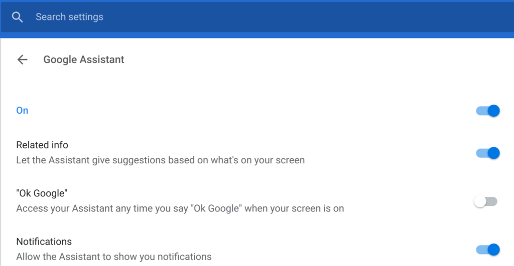
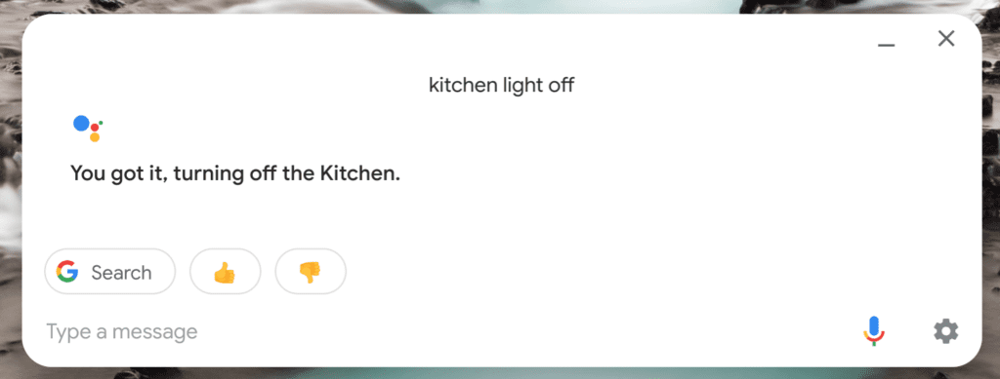

Earlier this week, 9to5Google reported that the [Chrome OS 72 Beta Channel adds support for the native Google Assistant on Chrome OS devices](https://9to5google.com/2018/12/18/google-chrome-72-beta/). Work on [Google Assistant for non-Google devices appeared two months ago in the Canary Channel](https://www.xda-developers.com/chrome-os-flag-google-assistant-all-chromebooks/) so it's not surprising. This feature first arrived on the [Pixel Slate with Chrome OS 71 Stable Channel](https://www.aboutchromebooks.com/news/chrome-os-71-update-features-pixel-slate/), with Google last week saying it would follow on other Chrome OS devices.

Aside from the fact that the Google Assistant has largely been limited to Google's own Chrome OS hardware to this point, it's important to note that this is a change from how the Assistant was first implemented on Chrome OS: Since this is a native integration, it doesn't require having the Google Play Store enabled which was previously the case.

That's important to a growing number of Chromebook owners who feel that by adding some of the latest new features -- think Android apps, Linux support, and possible [dual-booting into Windows](https://www.aboutchromebooks.com/news/project-campfire-windows-dual-boot-chromebook/) -- Google is getting away from the "simplicity" that Chrome OS used to provide. I'll share more thoughts on that later in another post.

For now, I wanted to share a video demonstration of how the native Google Assistant feature works in Chrome OS; more specifically on a Pixel Slate. ChromeStory's Dinsan Francis is firing up a new YouTube channel and his [Google Assistant "how to" demo](https://www.chromestory.com/2018/12/how-to-use-google-assistant-on-chromebooks/) is one of the first videos for it. He's looking for feedback and since it ties in with the Google Assistant news, here it is:

\[embed\]https://youtu.be/2itgctzBGiM\[/embed\]

I've actually disabled the "always listening" function of the native Google Assistant on my Pixel Slate. Here is the setting to do that:

Don't get me wrong, it works great when enabled and saying "OK Google" aloud. My challenge is that I have more digital assistant speakers in my home than I have rooms to put them in because of work I do for [an IoT site](https://www.staceyoniot.com) and related [IoT podcast](https://www.iotpodcast.com).

When I speak to the Assistant on my Pixel Slate, sometimes the response comes from the Slate and sometimes it comes from some other smart speaker or smart display, which I find offputting. But that's just me.

However, I do make use of the native Assistant, particularly when I'm working on the Slate in my bedroom and my wife is sleeping.

Instead of using voice commands to shut lights or change the thermostat settings, I just hit the Assistant key on the Pixel Slate Keyboard and type something like "downstairs lights off", for example. There's no need to wake my wife with a voice command that way.

It makes perfect sense for Google to expand Assistant support beyond the Pixelbook and Pixel Slate, just as it makes sense for the company to launch new features first on its Pixel line of phones and later bring them to many other Android devices. Google knows that not everyone will buy a Google-branded device but it wants to have as many people using its services as possible.
