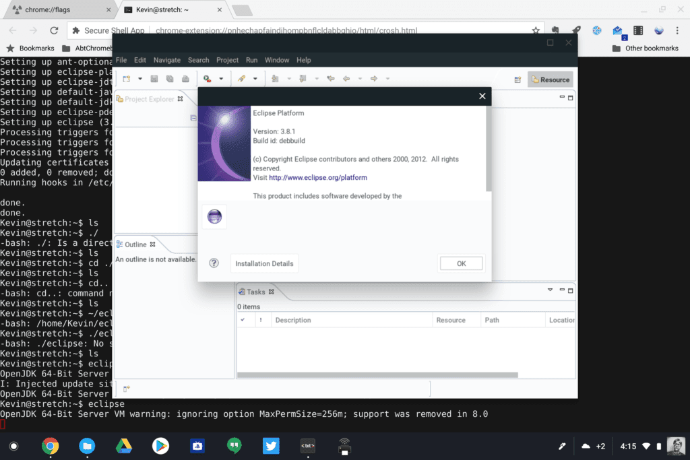

The Stable channel of Chrome OS 73 is nearly here for consumer Chromebooks and there are some key business features for those that use [Chrome devices for business in this release](https://support.google.com/chrome/a/answer/7679408?hl=en). Some functions are a "catch up" to what consumers can already do on a Chromebook, while others are new and specific to enterprises.

Perhaps the biggest part of the update is support for Linux apps in the enterprise. This is handled through [Crostini, which creates a secure virtual machine that runs a sandboxed Linux container;](https://www.aboutchromebooks.com/tag/project-crostini) something mainstream Chromebook users have enjoyed since Chrome OS 69. Without this feature, I'd never be able to [use my Pixel Slate for Java coding in my Computer Science class](https://www.aboutchromebooks.com/news/how-to-code-on-a-chromebook-crostini-pixel-slate/).

From a business perspective, this opens up a range of desktop application possibilities for when a web or Android app simply won't do. And I can vouch for its effectiveness when developing applications, something that's quite prevalent in many enterprises today.

Although Crostini became available in Chrome OS 69, managed devices in work world couldn't use the feature because there wasn't a mechanism to centrally enable or disable it. Chrome OS 73 adds this as a managed device policy so that companies can decide if they want to allow it, and if so, to whom in the enterprise. By default, the policy is disabled, so if you need access to Linux apps, you'll need to contact your Chrome OS adminstator.

Another new function is the ability to provide managed guess sessions on any Chrome OS device in the workplace. [Google describes it this way](https://cloud.google.com/blog/products/chrome-enterprise/making-device-sharing-easier-with-chrome-enterprise):

> Managed guest sessions are a good solution for giving employees, customers, patients and other users temporary or shared access to Chrome devices. And because of Chrome OS’s flexibility, organizations can use the same devices for both managed guest sessions and for sessions where a user is logged in with an identity.

The idea here is that a company can leverage existing Chrome OS devices for sharing between employees instead of purchasing devices for each individual. While employees could always sign in to another device as a guest, this new feature brings support for Chrome apps and extension synchronization, network certificates and available enterprise policies to "follow" the employee on any machine.

There's [plenty more in Chrome OS 73](https://www.aboutchromebooks.com/tag/chrome-os-73), particularity for consumers, but if you're interested in the full release notes as they pertain to enterprises, [Google has a list of them here](https://support.google.com/chrome/a/answer/7679408?hl=en).
