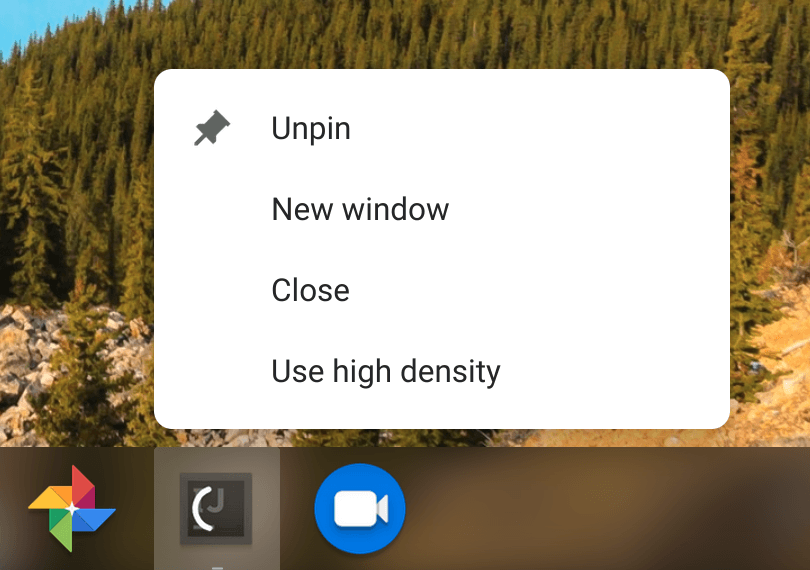
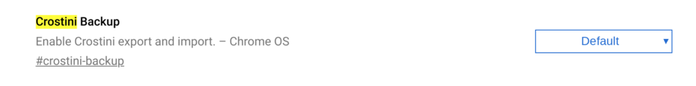
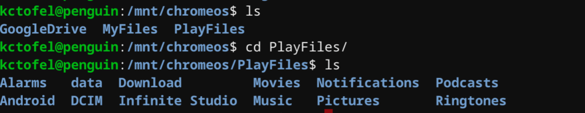
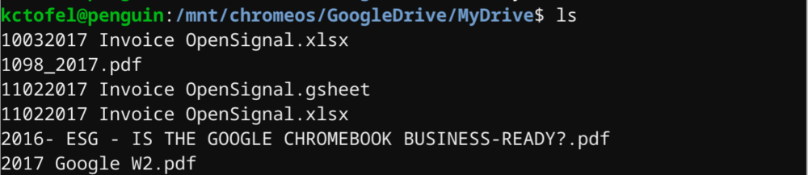
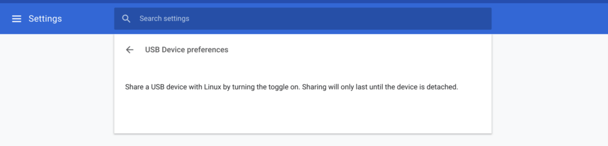
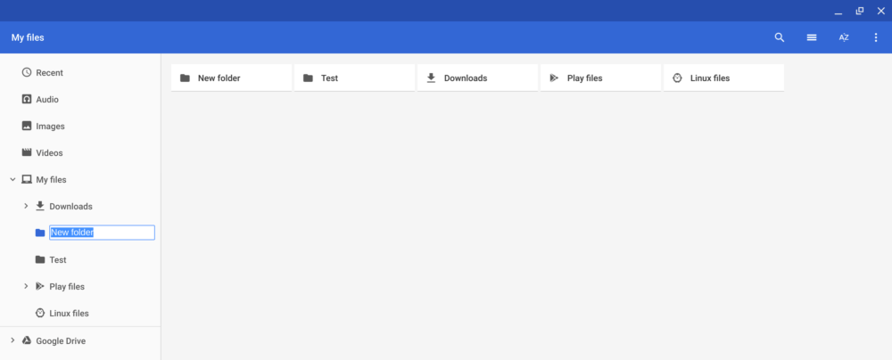

On Tuesday, [Google released the first iteration of Chrome OS 73 for the Dev Channel](https://chromereleases.googleblog.com/2019/01/dev-channel-update-for-chrome-os_15.html) and there are quite a few new items related to Project Crostini, for Linux app support. Some things in the [lengthy changelog](https://chromium.googlesource.com/chromium/src/+log/72.0.3626.49..73.0.3669.0?n=100) only set up new features coming soon while others add new functionality. Here's a rundown on some of the Crostini additions to Chrome OS 73.

One is the choice of [running Linux apps in either high or low density](https://www.aboutchromebooks.com/news/chrome-os-72-dev-channel-brings-hidpi-toggle-for-linux-apps-in-project-crostini/) that I found in version 72 of the Dev Channel. However, it appears that once you set the display density for a Linux app, [it now saves your preference](https://chromium.googlesource.com/chromium/src/+/72508a5fde16bc4c116a8616e3395a7ec434a6c4). At least it has, so far in my testing.

Next up is [a new flag that will enable backups of your Crostini container data files](https://chromium.googlesource.com/chromium/src/+/42387103eebd0d83079a70040225b475be44e27e). The flag is available at _chrome://flags/#crostini-backup_ and is disabled by default. I've enabled it but don't think the functionality is there yet based on the code commits.

Originally, the idea was when a user disables Linux on a Chromebook, prior to deleting the Terminal app and Linux containers, an option would appear to back up the data files. The implementation may change, however; there's a protected Google Doc outlining how this will work so I can't say for sure yet. I do know the backup function doesn't work, even with the flag enabled: I wiped my Linux partition on a test device and no backup option appeared, nor were any Linux files backed up. The backup feature is slated for Chrome OS 74.

There's an option to now share Android's Google Play Files, My Files and even Google Drive with Linux in the native Chrome OS Files app. Right-clicking on any of these and clicking the "Share with Linux" option mounts them in your Linux container under _/mnt/chromeos_ as shown:

\[caption id="attachment\_2717" align="aligncenter" width="1000"\] Google Play files mounted in Linux\[/caption\]

\[caption id="attachment\_2718" align="aligncenter" width="1000"\] Google Drive files mounted in Linux\[/caption\]

Note that both files and folders from Google Drive appear here, although I didn't show any folders.

USB device support is also coming along with Chrome OS 73: In the Linux settings within Chrome OS, there's a [new option to manage USB device sharing](https://chromium.googlesource.com/chromium/src/+/88aaac6e85b3c40f1de98e1b00e68c39d8c64ea1). I don't have any USB devices on-hand such as an Arduino board or some other external device to test if support now goes beyond file storage.

And although it doesn't seem to be working yet, the beginnings of a new feature to [search for Linux installation packages from the Launcher search has begun](https://chromium.googlesource.com/chromium/src/+/3cafe43c57fc74537a48fa4f740f53b962d87a42). [Chrome Story recently uncovered this functionality](https://chromium.googlesource.com/chromium/src/+/3cafe43c57fc74537a48fa4f740f53b962d87a42) and it will be a huge help for those not used to Linux if it can help them find Linux apps through the native search functionality in Chrome OS as opposed to using the command line or browsing on the web.

There may be additional Crostini features in Chrome OS 73, so I'm still poring over the release notes and will update as necessary. For now, though, there's a bunch of good items either available or coming soon to look forward to.

_**Update**_: I almost forgot the new top-level folder feature spotted by MSPowerUser a few days ago. You can now create top-level folders under My Files in Chrome OS. Just click My Files and then hit the three-dot menu at the top right of your Files app. From there, you can choose the "New Folder" option so that everything isn't under the Downloads folder.

