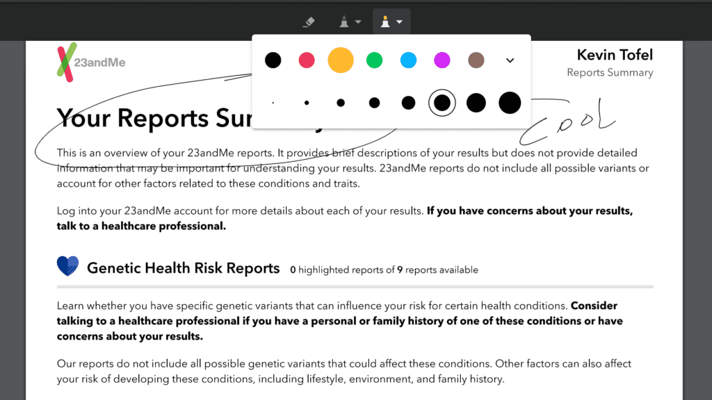

The [Chrome OS 73 Dev Channel got an update on Wednesday](https://chromereleases.googleblog.com/2019/02/dev-channel-update-for-chrome-os.html) and there's a nifty useful feature: Native PDF annotation. Opening a PDF still uses the Chrome browser, but new is a pen icon to mark up PDF docs. This functionality was [spotted by Reddit user AndrewCToscano](https://www.reddit.com/r/chromeos/comments/any2if/pdf_annotating_is_here/) and later [reported by Android Police](https://www.androidpolice.com/2019/02/07/google-adds-pdf-annotation-feature-to-chrome-os-dev-canary/).

Since this is still an experimental feature, it currently requires a flag setting to be changed. I had to enable _chrome://flags#pdf-annotations_ and restart my browser. After that, I loaded up a PDF on a Pixel Slate running the latest Dev Channel to see that Google has the basics down.

I could change the pen tip size and color, for example. Not resizable, at least not yet, is the eraser function. Once you're in eraser mode, touching a stylus or your finger to any markups you've made will erase the entire markup object, so don't expect to remove just a portion of your writing. Closing the marked up PDF didn't prompt me to save the updated file either, although there is a Save icon at the top right of the interface.

Although this seems like a small, basic change to Chrome OS, I think it will have a big impact across a wide range of users; particularly those who work in a document-centric world. Yes, there are PDF annotation apps for Android, but a native Chrome OS tool is more seamless, even if it's not quite as fully featured.

If you want to sneak an early peek at PDF annotations, it’s easy to [change over to the Dev Channel](https://www.aboutchromebooks.com/qa/whats-the-difference-between-developer-mode-and-the-dev-channel-on-a-chromebook/), but remember: You will likely see more bugs than on the Stable Channel. Additionally, if you switch back to a lower numbered version of Chrome OS, all local data on your device will be wiped out.
