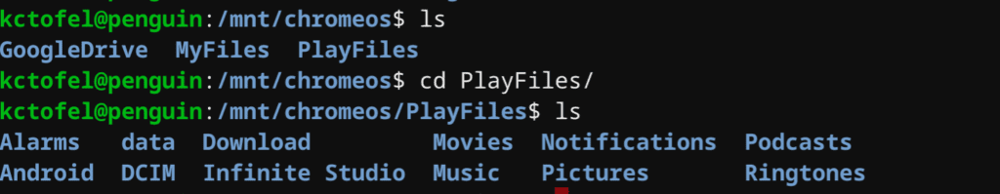

Last week, [Google announced the availability of Chrome OS 73 in the Stable channel](https://chromereleases.googleblog.com/2019/03/stable-channel-update-for-chrome-os_25.html) and began to push the platform update out to devices. Since the rollout is always staggered, my Pixel Slate wasn't upgraded until recently so I've only now just got a chance to go through what's new and improved.

For starters, here's what Google says is in Chrome OS 73:

- Better Chrome OS out-of-memory management
- Report additional telemetry data for Chrome OS devices
- Alerts regarding upcoming removal of remaining Chrome Supervised Users
- Video Player: switch to native media controls
- Demo Mode: Switch language setting
- Audio Focus on CrOS
- Developers can share files/folders with Linux apps.
- Improved native Drive integration with added support for the Drive->Computers root in Files app
- Demo Mode: Offline enrollment and setup functionality
- For managed devices, the remotely configured 20 printer maximum cap will be raised to allow for several thousand native printers for each organizational unit in the Google Admin console. 

That's helpful. But here’s what **_else_** is in there based on my testing experience since Chrome OS 73 landed in the Dev Channel back in January:

## Google Drive and Play Files mount in Linux

There’s an option to now share Android’s Google Play Files, My Files and [even Google Drive with Linux in the native Chrome OS Files app](https://www.aboutchromebooks.com/news/chrome-os-73-dev-channel-adds-google-drive-play-files-mount-in-linux-usb-device-management-and-crostini-backup-flag/). Right-clicking on any of these and clicking the “Share with Linux” option mounts them in your Linux container under /mnt/chromeos as shown:

If you don't see a "Share with Linux" option when right-clicking your Google Drive in the Files app, you may need to enable this flag: _chrome://flags/#enable-drive-fs_.

## Native PDF annotation support

This feature is also behind a flag, so if you want to try it, you'll need to enable _chrome://flags/#pdf-annotations_. Once you do that and restart your browser, you can mark up PDF documents with a digital pencil or highlighter. An actual Pixelbook Pen isn't required as long as your Chromebook has a touchscreen: You can just use your finger.

## Linux support for enterprises

Although consumers first gained [Project Crostini to run Linux apps with Chrome OS 69](https://www.aboutchromebooks.com/news/chrome-os-69-stable-release-project-crostini-linux-apps/), managed devices, such as those in enterprises and schools, did not. That's because there wasn't a Chrome management option to allow or deny Linux usage until now. [With that management policy available in Chrome OS 73](https://www.aboutchromebooks.com/news/chrome-os-73-brings-linux-app-support-managed-guest-sessions-to-enterprises/), business and schools can use Linux apps if their Chrome administrator allows it. I suspect this also applies to individual GSuite users as well.

## Linux package installs show app name, version and details

The idea here is that when using the native Files app to install a Debian package — essentially a Linux app — [users will know more about what it is they’re actually installing before they click that Install button](https://www.aboutchromebooks.com/news/linux-package-installs-on-chromebooks-to-show-app-name-version-and-details-possibly-in-chrome-os-73/), making the experience a little more user-friendly and informative. In the example below, I downloaded the KDevelop package and right-clicked it in my Files app. The new dialog box provides plenty of useful information prior to installation

## Optimizations for animations in tablet mode

I can see a marked difference in the tablet animations on my Pixel Slate with Chrome OS 73. Overall, it's a smoother experience to switch between apps in the overview or split-screen modes when using a Chrome OS tablet or 2-in-1 as a tablet. Then again, I have the Core i5 Pixel Slate with 8 GB of memory, not the Celeron unit with half the RAM, so I can't speak to that particular device. And there's still room for improvement as I see some dropped frames. Luckily, [Google isn't done working on this challenge](https://www.aboutchromebooks.com/news/chrome-os-73-bringing-additional-tablet-transition-fixes-to-2-in-1-chromebooks-pixel-slate/).

## Audio support for Linux didn't make the cut

Originally planned for Chrome OS 73, [audio support for Linux apps have been pushed back as anticipated back in January](https://www.aboutchromebooks.com/news/audio-support-linux-chromebooks-chrome-os-74-crostini/). The feature is working for me [in the Chrome OS 74 Dev Channel](https://www.aboutchromebooks.com/news/chrome-os-74-audio-playback-support-linux-on-chromebooks-project-crostini/), so barring any major bugs or issues, it should still be on track for the next major update, [expected roughly April 30 or so, per the Chromium release calendar](https://chromiumdash.appspot.com/schedule).
