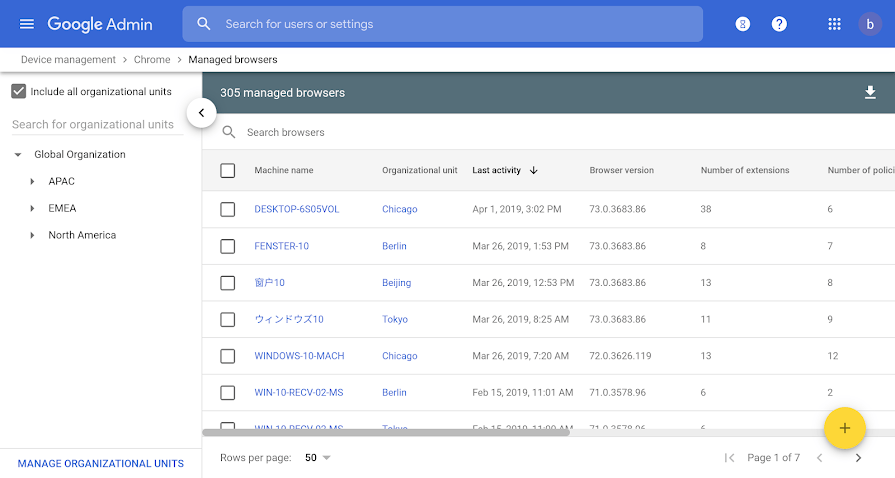
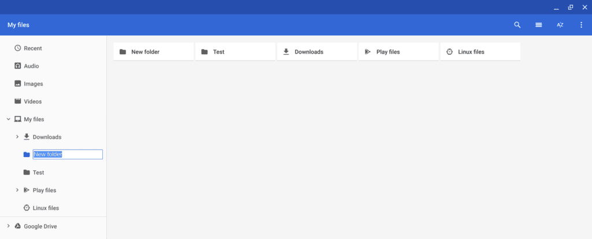

Per the typical release cycle, [enterprises have the Stable Channel of Chrome OS 74](https://cloud.google.com/blog/products/chrome-enterprise/admin-insider-whats-new-in-chrome-enterprise-release-74) before consumers and today, the release notes for this version were made public by Google.

Some new functionality isn't specific to Chrome OS but is no less useful. In particular, is the Chrome Browser Cloud Management Console which provides a centralized browser management tool across all device platforms in the enterprise. Legacy Browser Support is now easier to deploy as well.

For the Chrome OS users, here's a rundown of what Chrome OS 74 adds, [per the release notes](https://support.google.com/chrome/a/answer/7679408):

- **Adobe PDF annotation support**: This has been [available in the Dev Channel since Chrome OS 73,](https://www.aboutchromebooks.com/news/chrome-os-73-dev-channel-adds-native-pdf-annotation-support/) hidden by a flag setting. Presumably, that flag is now enabled by default for enterprise users or can be managed through the Chrome Admin console.
- **Improved search features**: When searching for apps or documents in the launcher search field, auto-suggestions will appear.
- **External camera support**: USB cameras can be used with the native Camera app in place of any integrated webcams. This includes cameras for document scanning and USB microscopes; I didn't make that last one up - that's a Google example.
- **Top level files and folders**: This is another welcome feature we knew was coming. No longer do all saved files or folders have to reside under "My Documents".
- **[Audio support for Linux apps](https://www.aboutchromebooks.com/news/audio-playback-for-chromebooks-arrives-in-latest-chrome-os-74-dev-channel-release/)**: This is solely for audio playback, [not recording](https://www.aboutchromebooks.com/news/microphone-camera-skype-video-chats-linux-for-chromebooks-project-crostini/), which is still in the works and is likely to arrive in Chrome OS 75. Still, it's handy for any enterprise workers developing in or working with Linux apps on a Chromebook.

Top-level folder example  

While several of these features will be useful for consumer Chromebook usage, one final one is very specific to enterprises: Native Active Directory integration policies.

With Chrome OS 74, enterprises "can now configure an existing domain to manage your Chrome devices with a Microsoft® Active Directory® server. If enabled, Chrome devices are domain joined to AD so you can see them in your domain controllers."
