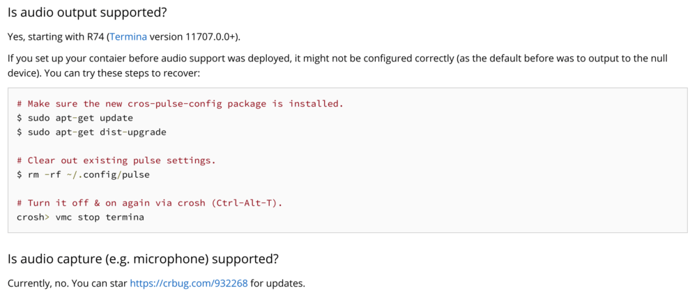

At long last, one of the three main feature deficiencies of Linux containers on Chromebooks is getting crossed off the list. According to the official [Project Crostini](https://www.aboutchromebooks.com/tag/project-crostini) documents, audio support for Linux is arriving in Chrome OS 74. Note that as previously reported, [this will not include audio capture](https://www.aboutchromebooks.com/news/microphone-camera-skype-video-chats-linux-for-chromebooks-project-crostini/), but only audio playback.

As shown below, the [official Crostini docs](https://chromium.googlesource.com/chromiumos/docs/+/master/containers_and_vms.md) point out that audio output comes with Chrome OS 74. I noticed this [documentation change in a code commit from last week](https://chromium-review.googlesource.com/c/chromiumos/docs/+/1474612) and the update is already public.

Audio support was initially targeted for Chrome OS 73 but was [pushed back to Chrome OS 74 in January.](https://www.aboutchromebooks.com/news/audio-support-linux-chromebooks-chrome-os-74-crostini/) I don't think the Chromium team would update the official documents if the feature wasn't going to make the cut for version 74, although there's always a chance testing surfaces some bugs that hold it up yet again.

Initially, I wanted to see [GPU acceleration](https://www.aboutchromebooks.com/news/pixelbook-and-nami-chromebooks-the-first-to-get-linux-gpu-acceleration-in-project-crostini/) and direct [USB device support](https://www.aboutchromebooks.com/news/project-crostini-usb-support-linux-chrome-os/) available to Linux on Chromebooks because then I could play the occasional game or modify an Arduino board with my Pixel Slate. After all, you can listen to music or videos within Chrome OS or Android already. But last week, I ran into a situation where the lack of audio support in Linux forced me to use a Mac temporarily.

I was creating a music note class in Java for my Computer Science class, [which was easy to code on the Pixel Slate](https://www.aboutchromebooks.com/news/how-to-code-on-a-chromebook-crostini-pixel-slate/). I then decided to take the assignment a step farther by importing the [JFugue library](http://www.jfugue.org/), which is a music player package for Java. I figured I'd just play some of music note objects programmatically, using JFugue. I added the library and a few lines of code and..... nothing. No music.

For 30 minutes, I kept trying to debug my code when I realized, _it's not the code_.

Since I was programming in Linux on the Slate, I couldn't hear the output without audio support! I pulled my code down from GitHub on my wife's Mac, fired up my app with two sample notes and sure enough, it worked just fine although my dog Norm didn't seem too impressed.

\[video width="1280" height="720" mp4="https://www.aboutchromebooks.com/wp-content/uploads/2019/02/JFugue-demo.mp4"\]\[/video\]

 

Based on the Chromium release calendar, Chrome OS 74 isn't slated to hit the Stable Channel until April 30. However, those on the Canary, Dev and Beta Channels will see this feature much sooner; I wouldn't be surprised to see it in the Dev Channel by the end of this month or so since [several devices already have access to Chrome OS 74 Canary](https://cros-updates-serving.appspot.com/)
