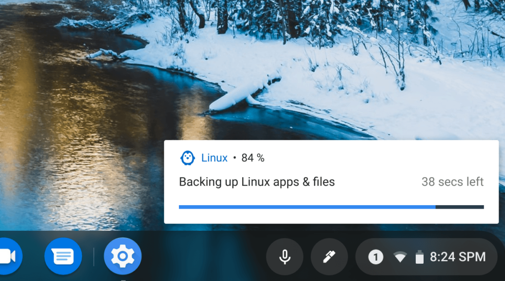
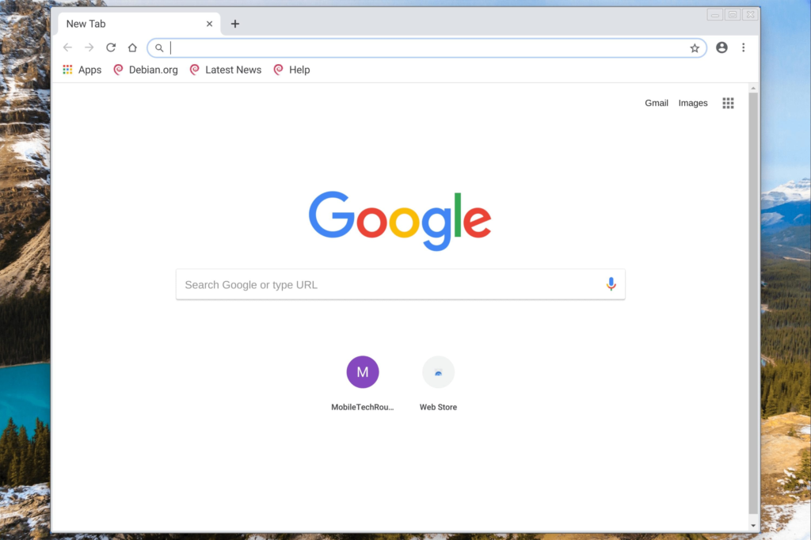

[Google released a new version of Chrome OS 74 for the Dev Channel](https://chromereleases.googleblog.com/2019/02/dev-channel-update-for-chrome-os_25.html) on Monday and there are a ton of references to "Crostini", which is the project that added Linux containers to Chromebooks. Among the many mentions -- there are over 500 -- is [audio support for Linux apps](https://www.aboutchromebooks.com/news/audio-playback-for-chromebooks-arrives-in-latest-chrome-os-74-dev-channel-release/) and the first implementation of [a backup and restore feature for Crostini](https://www.aboutchromebooks.com/news/what-linux-backup-restore-for-chromebooks-user-interface-chrome-os-74/), which I mentioned was coming earlier this month.

The user interface for backups and restores looks exactly as I reported and even better: The functionality works, provided you have first enabled it. To do so, type _chrome://flags/#crostini-backup_ and set it to "enabled". After restarting your browser, the feature should work.

I tested it after upgrading to the latest Dev Channel on a Pixel Slate and it saved a backup in the Downloads folder. This, of course, can be moved to Google Drive or external storage for safe keeping. Or you can simply choose a different location, including external storage: I tested an SD card through the USB-C hub I use with my Pixel Slate.

After performing the backup, which took about three minutes for my files, I then removed the Linux container entirely from the Pixel Slate, rebooted and then re-enabled Linux support.

The restore process took another two minutes and my entire Linux container was completely restored: both apps and data.

Running Chromium right after a container restore  

This a key feature for those using Linux containers. In my case, [I do all of my Java programming for Comp Sci class using IntelliJ for Linux](https://www.aboutchromebooks.com/news/how-to-code-on-a-chromebook-crostini-pixel-slate/) and while all of my code is safely stored on GitHub, the ability to backup and restore IntelliJ and my work brings a sigh of relief.

Since this is the Dev Channel though, I won't rely on this feature 100% just yet. In fact, the Chrome OS Files app no longer shows my Linux files at all, so clearly there are some issues - for now, I can access those files through the Linux terminal.

I'll be poring through the remaining Crostini mentions in the Chrome OS 74 changelog, so stay tuned!

_Updated at noon ET on 2/26/2019 to reflect that you can choose the location of the backup and/or restore file, including external storage._
