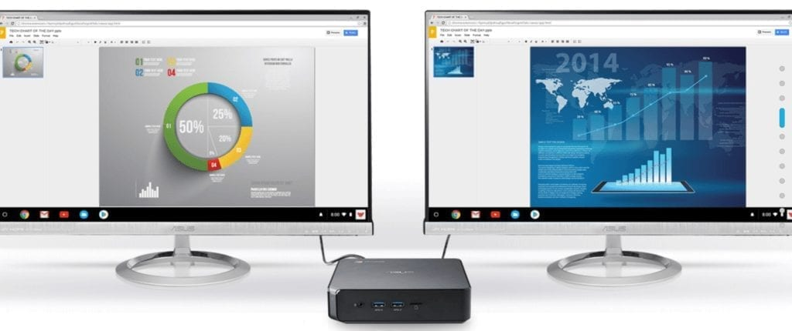

It's only been a month since [Chrome OS 73 landed on the Stable Channel](https://www.aboutchromebooks.com/news/chrome-os-73-stable-version-what-you-need-to-know/) and here we are with Chrome OS 74 now available. Google announced Chrome OS 74 for the Stable Channel this past week and it's filled with fixes and new features for Chromebooks.

Here are the [official release notes from the Chrome Releases blog](https://chromereleases.googleblog.com/2019/05/stable-channel-update-for-chrome-os.html), many of which I've previewed, so you can hit the linked items to see more information:

- Send system performance profiling data along with feedback reports
- [Linux apps can output audio](https://www.aboutchromebooks.com/news/audio-playback-for-chromebooks-arrives-in-latest-chrome-os-74-dev-channel-release/)
- [USB camera support](https://www.aboutchromebooks.com/news/chrome-os-74-arrives-for-enterprises-heres-what-it-brings/) for the Android Camera app
- Removal of deprecated supervised users
- \[Accessibility\] ChromeVox developer log options: There are now a number of developer options available within the ChromeVox Options page which enable developers to turn on logging for speech and other items
- Support for new files and folders under the “My files” local root
- Users can quickly access their most recent apps and Google searches by clicking on the search box
- [Annotate documents from the Chrome PDF Viewer](https://www.aboutchromebooks.com/news/chrome-os-73-dev-channel-adds-native-pdf-annotation-support/)

Root level folder creation

Additionally, Google planned to address some [system slowness in the Hangouts app with this version,](https://www.aboutchromebooks.com/news/chrome-os-74-may-address-chromebook-slowness-caused-by-hangouts-video-chat/) something that I haven't seen but many commenters and readers have experienced. [That bug report shows Chrome OS 74 as the target](https://bugs.chromium.org/p/chromium/issues/detail?id=947577), so the tested fix may be in this version.

If you have a Chromebox built on the "fizz" platform - there are five of these devices - you may get [GPU acceleration for Linux apps with Chrome OS 74](https://www.aboutchromebooks.com/news/four-chromeboxes-next-up-to-get-gpu-acceleration-for-linux-likely-in-chrome-os-74/) as well. The HP Chromebox G2, Acer Chromebox CXI3, ViewSonic NMP660 Chromebox, Asus Chromebox 3, CTL Chromebox CBX1 are all targeted to get this feature for Linux on Chrome OS.

Speaking of Linux, the old _[crostini-files](https://www.aboutchromebooks.com/news/project-crostini-chrome-os-files-share-with-linux/)_ [flag that enables sharing to a Linux container](https://www.aboutchromebooks.com/news/project-crostini-chrome-os-files-share-with-linux/) has been removed in this release because the feature is permanently on by default.

Even better is that the [Linux container backup and restore feature is now live in Chrome OS 74](https://www.aboutchromebooks.com/news/what-linux-backup-restore-for-chromebooks-user-interface-chrome-os-74/). Now you can export the state of a Crostini container and restore it to get your Linux programs, data, and settings in the case of a problem.

These can be saved to an external storage device such as an SD card or USB flash drive. I tested this in February and it then worked like a charm.

I'll be continuing to review the [lengthy code change log](https://chromium.googlesource.com/chromium/src/+log/74.0.3729.125?pretty=fuller&n=10000) and will update this post with any additional finds.
