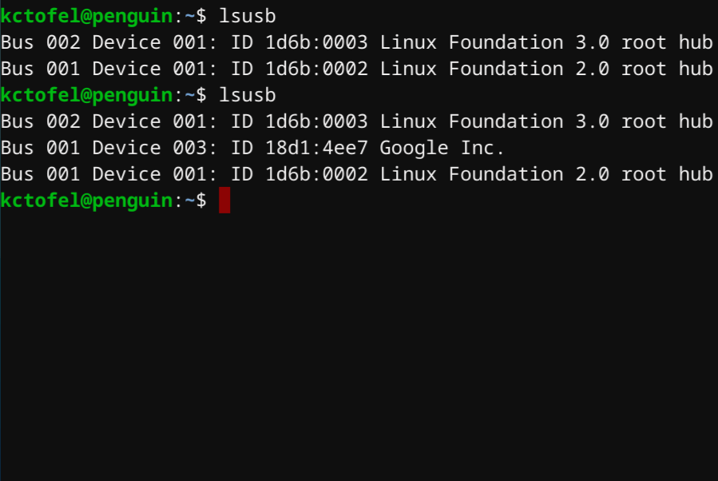
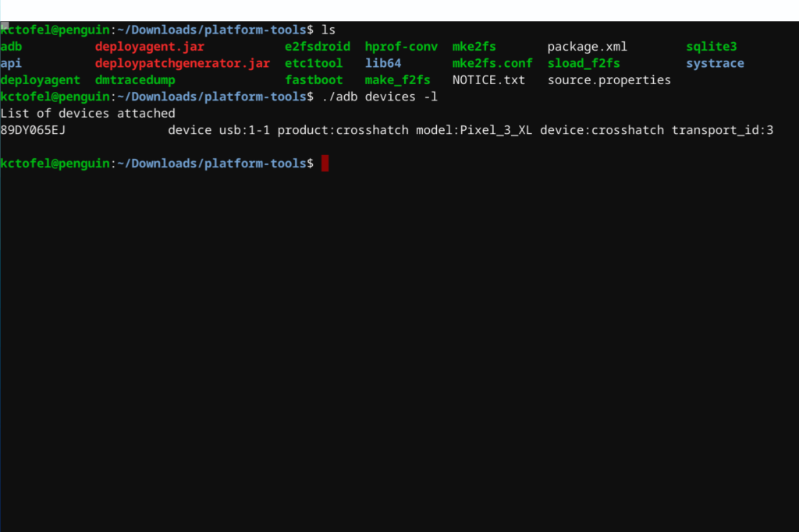

The first version of Chrome OS 75 Canary Channel landed a few days ago and it addresses a key functionality gap for Linux containers: USB device support.

We knew this feature was in the works as the [Stable Channel of Chrome OS 73](https://www.aboutchromebooks.com/news/chrome-os-73-stable-version-what-you-need-to-know/) brought [a menu option for USB Device management.](https://www.aboutchromebooks.com/news/chrome-os-73-dev-channel-adds-google-drive-play-files-mount-in-linux-usb-device-management-and-crostini-backup-flag/) while [Chrome OS 72 added USB storage for Linux apps](https://www.aboutchromebooks.com/news/chrome-os-72-dev-channel-usb-sd-card-support-project-crostini-chromebooks-android-9-pie/).

[Keith Myers noted the addition of USB device support for Linux on a Chromebook](https://kmyers.me/blog/chromeos/chromeos-75-0-3759-4-brings-proper-usb-support-to-linux-applications-and-breaks-a-few-things-in-the-process/) and did some testing with his 3D Printer, an Arduino board and a Intel Movidius Compute Stick. This feature is important for those who want to control, pass or read data to some type of external USB device from the Linux container. Keith noted some functions that Chrome OS 75 breaks as well, which is to be expected in the fast-changing Canary channel.

Since I dabble with small computing devices myself - my CS group is extending a ["pancreas in the cloud" project using a Raspberry Pi](https://openaps.org/), for example - I decided to test some additional features that would be super important for many folks: the Android Debug Bridge (ADB) that lets you modify an Android phone or tablet to install custom software or recovery images.

Chrome OS 75 isn't yet available on the Dev Channel, so I took the plunge of putting a supported Chromebook in Developer Mode and installed Chrome OS 75; you can [see if your device has access to this version here](https://cros-updates-serving.appspot.com/).

To use the new USB device feature, you also have to enable both _chrome://flags/#crostini-usb-allow-unsupported_ and _chrome://flags/#crostini-usb-support,_ which I did after upgrading to Chrome OS 75.

After my browser restarted, I went into my Linux container and I connected my Google Pixel 3XL to the Chromebook. This popup notification to connect appeared and chose to connect the device. Running the _lsusb_ command in Linux shows the new device attached:

Now that the Linux container saw the USB device - my Pixel 3XL in this case, I ran a few ADB commands, since I already have them installed as part of Android Studio. Sure enough: Whatever ADB functions I used to do on a PC and Mac can now be done right from my Chromebook!

The timing of this new feature coincides nicely with next month's Google I/O developer event even though I don't think USB device support in Linux on Chromebooks won't likely arrive in the Stable channel until after I/O.

Last year, [Google said that it would officially support Android Studio for Android app development on Chromebooks](https://www.aboutchromebooks.com/news/google-officially-unveils-project-crostini-linux-apps-on-chrome-os/) in 2019, which includes ADB support. The company has been working on that since the last I/O event, so I anticipate an on-stage announcement that Android developers will have a fully working environment on Chromebooks within weeks of Google I/O.

Remember, if you want to try this by moving to the Canary Channel, you will see bugs. And to access Canary, you first have to put your Chromebook into Developer Mode, which disables some Chrome OS security features and wipes all local data, so attempt this at your own risk. Most people would be better off waiting until USB device support arrives in the Dev Channel, so I'll be sure to share news of when that happens.
