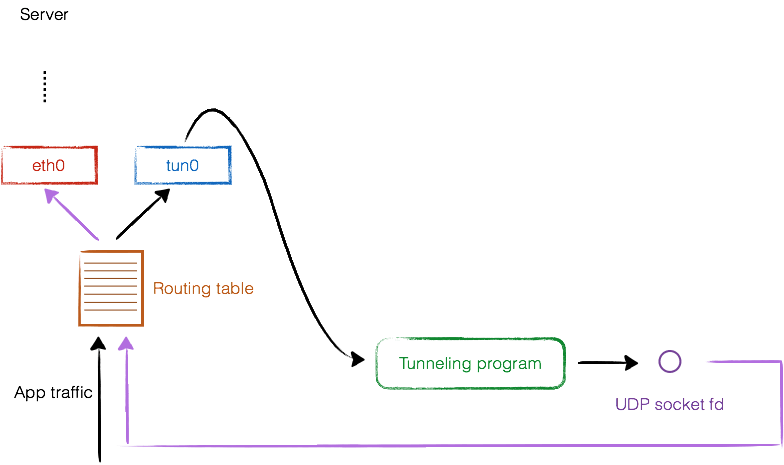

Google is still working on [native VPN functionality for apps running in a Linux container on Chrome OS](https://www.aboutchromebooks.com/news/vpn-tun-support-linux-on-chromebooks-project-crostini/) but has recently completed a code change to extend Android VPN support to Linux. The [Dev Channel of Chrome OS 75 brings this VPN support](https://bugs.chromium.org/p/chromium/issues/detail?id=834585#c51), as well as a few other fixes.

I received word of the Android VPN support by email since I starred that issue some time ago and it was also noticed by Keith Myers, [who wrote it up on his blog after testing OpenVPN for Android](https://kmyers.me/blog/chromeos/chromeos-75-0-3770-10-rolling-out-to-the-dev-channel-enables-vpn-support-in-crostini-and-other-fixes/). He writes:

> Your Linux container will now route traffic over a VPN if you have a VPN running on your Chromebook. This includes both VPNs setup in the ChromeOS VPN settings and Android VPNs! I have personally tested this using the OpenVPN application on Android connecting to my personal VPN and it worked flawlessly.  
> There are no flags to enable, it just works.  
>   

I haven't tested it myself yet since I'm not currently running a Chromebook on the Chrome OS 75 Dev Channel, but I fully trust Keith's testing prowess. He also notes some other fixes, including the Google Assistant button, which was broken for supported devices with Chrome OS 74.

VPN tunneling

Why have both an Android VPN and still-in-progress native Linux VPN for Chrome OS? It makes sense because on the Linux side, you'll have more control and configuration options. Additionally, some enterprises have custom VPN services and settings that may not be supported in an Android VPN app.

Although this new VPN feature is available in the Dev Channel of Chrome OS 75, most people won't see it for some time because the Stable Channel is currently expected to drop in mid-June. You can always try it early [in the Dev Channel](https://www.aboutchromebooks.com/qa/whats-the-difference-between-developer-mode-and-the-dev-channel-on-a-chromebook/) now, or soon in the Beta Channel if you want to test it out.
