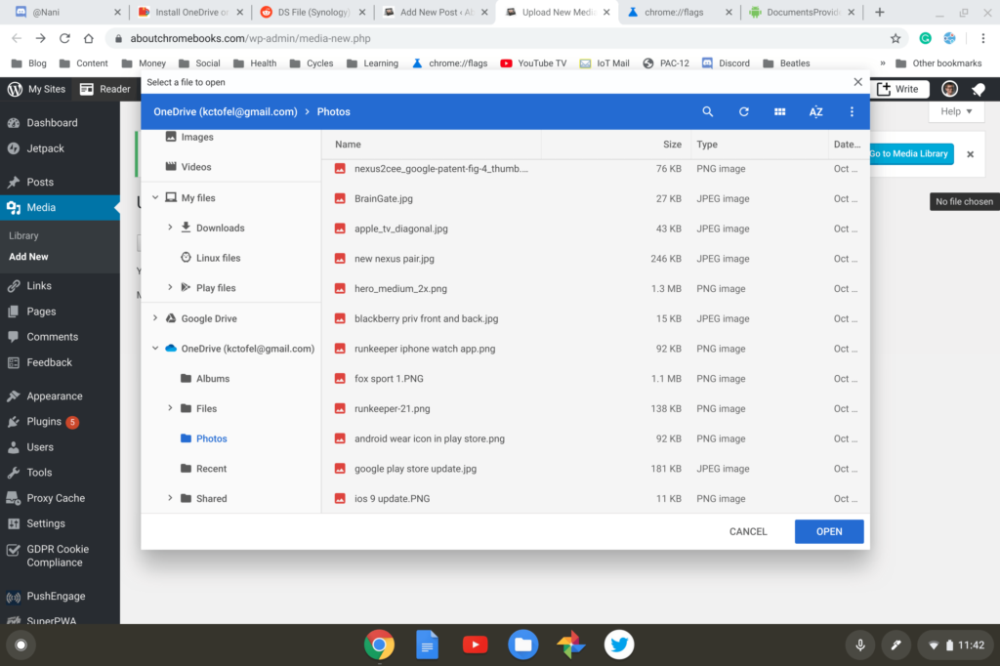

[Chrome OS 75](https://www.aboutchromebooks.com/tag/chrome-os-75/) should hit the Stable Channel at any time now; in fact, I expected it to have landed this past week. When it does finally appear for Chromebooks, you'll likely see what I think is a great new feature: Installing an Android cloud storage app will cause that storage to appear in the native Chrome OS Files app as a mounted drive.

[Chrome Story recently shared this news](https://www.chromestory.com/2019/06/onedrive-chrome-os-files-app/), which was [first spotted about a month ago on Reddit](https://www.reddit.com/r/chromeos/comments/bkec6d/ds_file_synology_navigation_added_to_files_app/). Users there noticed not only a Microsoft OneDrive mount in the Files app when using early builds of Chrome OS 75, but also access to NAS, or Network-Attached Storage drives from the Files app when a supporting NAS Android app was installed.

In my testing, cloud storage mounts weren't appearing, so I dug around in _chrome://flags_ and enabled the _arc-documents-provider_ setting. After a quick restart, I saw OneDrive mounted in my Files app since I had previously installed the Android version of OneDrive.

I also found out that installing Dropbox for Android does _not_ work with the Files app. At least not yet. I suspect Dropbox hasn't fully implemented the [DocumentsProvider API](https://developer.android.com/reference/android/provider/DocumentsProvider) in its Android app. That's the only reason I can think of for my Dropbox storage not mounting to the Files app, although I could be wrong.

I don't have a NAS drive, so I couldn't test that, but the Reddit thread has a few people with positive results in that regard.

For someone like me who mainly works in a browser with cloud services, this is fantastic. I'm often downloading images I have stored on various cloud services only to then upload them to another cloud service, such as Wordpress, which is what this blog is run on.

Now, I can choose saved images on OneDrive directly in the Files app - or even the Wordpress uploader, since it uses an instance of Files for media uploads - and push them to a post.

**_Update at 1:06 pm ET, June 22:_** I've installed the Box.com Android app for testing, signed in and it mounted to the Files app on my Chromebook. :)

