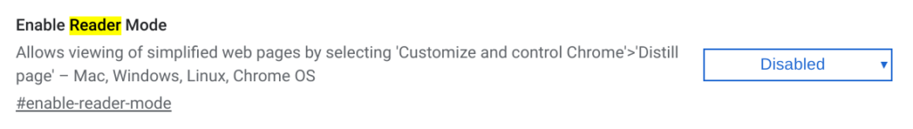
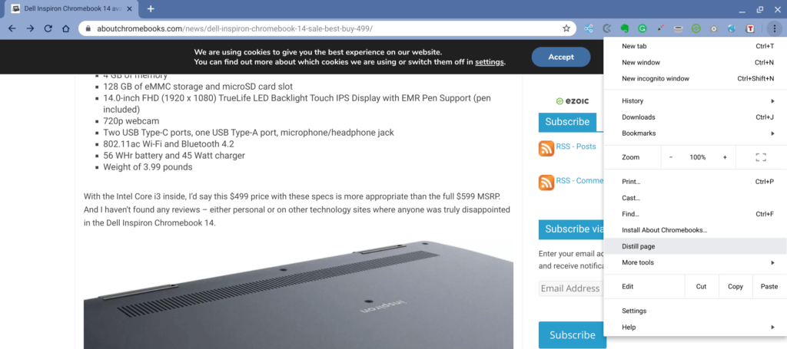
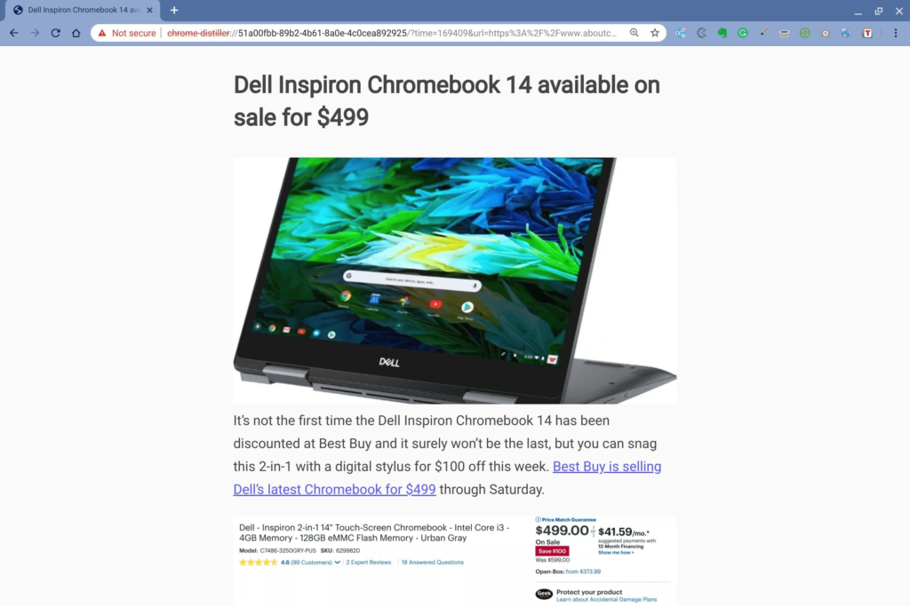
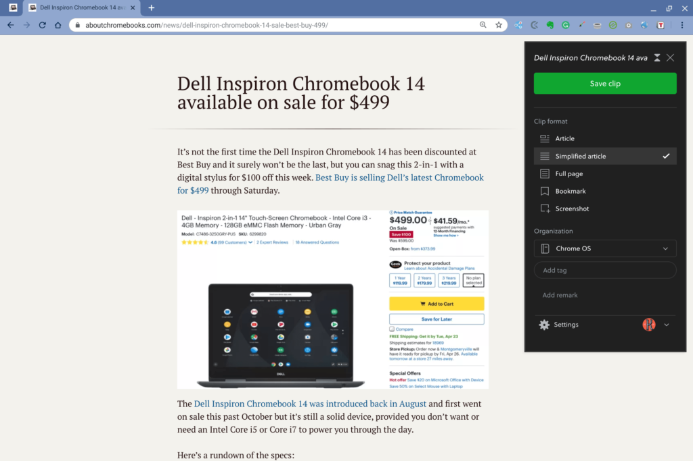

Last week ZDNet noted that the [Canary Channel of Chrome OS 75 included a distraction-free "reader mode" for Chromebooks](https://www.zdnet.com/article/google-chrome-to-get-a-reader-mode/). I finally got around to trying it out on a device running the not-always-stable Canary Channel and it looks good: Only text and images from web pages appear, with none of the added clutter that often gets in the way.

Although I don't recommend it, if you want to try this mode, you'll have to be on the Canary Channel for now. I don't recommend it because you have to put your Chromebook in [Developer Mode](https://www.aboutchromebooks.com/qa/whats-the-difference-between-developer-mode-and-the-dev-channel-on-a-chromebook/), which does eliminate some of the key security features of Chrome OS. Since this is a spare device, I took the plunge.

Once on the latest Canary Channel build of Chrome OS 75, you have to enable the flag for it, found at _chrome://flags/#enable-reader-mode_.

After a browser restart, you're good to go. When visiting any web page, you can click the three-dot menu button at the top right of your browser and choose the "Distill page" option.

Here is what you'll see on the example page I chose above: No ads, no extras, nothing. Simply the text of the page and any images that correspond to the text:

As nice as this is from a reading perspective, I actually still prefer my current method of a reader mode: I use the [Evernote extension for Chrome](https://chrome.google.com/webstore/detail/evernote-web-clipper/pioclpoplcdbaefihamjohnefbikjilc?hl=en).

Most people think of saving web pages offline with the Evernote extension and that's because it is the primary function. In fact, I often use it for that very purpose when scanning articles, sites and feeds. But you might not know that the Evernote extension also includes a "simplified article" mode, which is essentially a reader mode.

Here's what the same page looks like using Evernote's simplified view:

It's really a personal preference to me since Evernote adds functions other than its reader mode; it's quicker to save a web page for off-line use for example.

Regardless, Chrome OS is long overdue to have a reader mode, so Google's effort is still good news. Hopefully, any bugs or add-on features are worked out for the [Chrome OS 75 target date](https://chromiumdash.appspot.com/schedule), which is currently mid-June.
