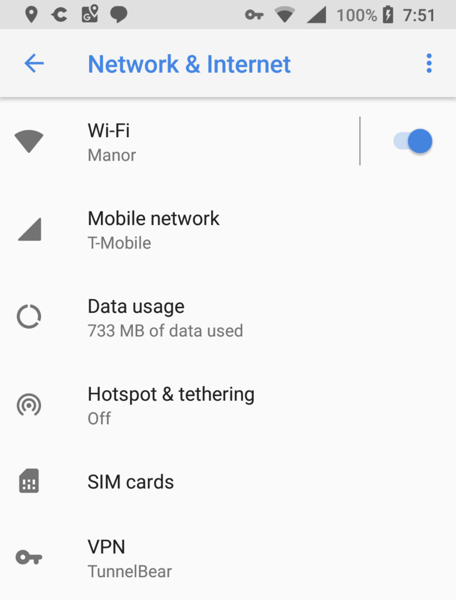
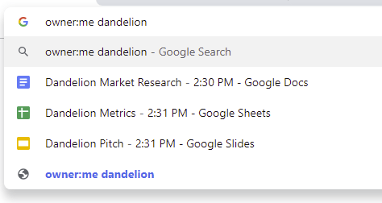

While consumers await Chrome OS 75 to drop this week, enterprises got an early look as the platform has already been updated. There aren't a large number of enterprise-centric features or improvements, but the ones that did make the cut are useful for work environments, such as expanded VPN support.

Android VPN option in Network & Internet settings

Among the more notable changes from [the official release notes](https://support.google.com/chrome/a/answer/7679408) are:

- **VPN connections in Linux**: Users with either an Android or Chrome OS VPN installed now have that [same network protection for Linux apps in a Crostini container](https://www.aboutchromebooks.com/news/chrome-os-74-75-android-vpn-support-to-linux-crostini/).
- **PIN code support for native printing**: End users might not be thrilled about this one but now businesses can require a personal or departmental PIN code before any printing is done. I wouldn't be printing any more Final Four brackets at work; at least not with my own PIN code.
- **Third-party cloud storage provider expansion in Files**: Any cloud or document provider that enables the DocumentsProvider API will now appear as a root drive in the native Files app.
- **DRM content on second monitors**: I guess if you want to host a Netflix party at work on the big screen, you can do this now. Then again, I'm sure there's some kind of business reason for this feature addition; help me out, readers!
- **Android device support over USB on Linux**: This is likely for the GSuite shops filled with developers who need to [debug in-house Android apps using the Linux container](https://www.aboutchromebooks.com/news/chrome-os-75-adds-usb-device-adb-android-support-linux-project-crostini/). Now they can.

Google notes some new features in the works for Chrome OS 76, including one that I'm fairly certain has long been available for consumer users: The ability to show Drive files in the URL address bar of Chrome.

Google says that Chrome OS 76 may also support CUPS print servers as well as notifications on the lock screen of a Chromebook, and also bring a wider range of USB device support for Linux apps.
