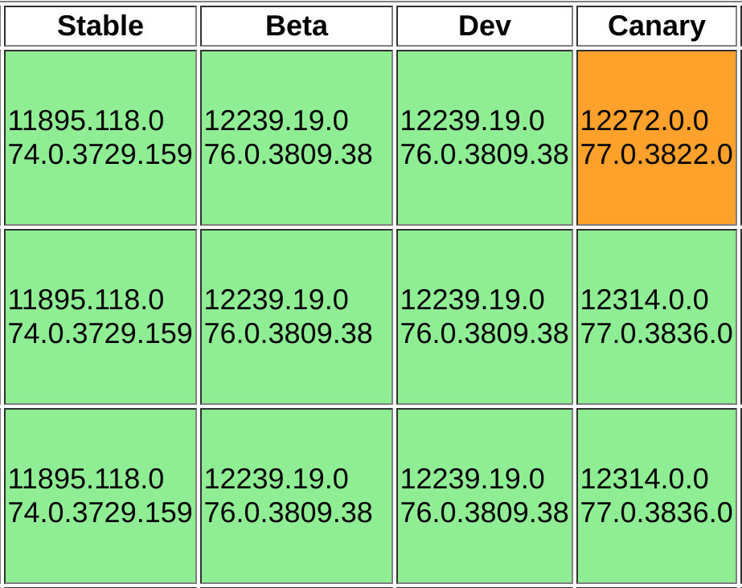

If you're waiting for your Chromebook to receive the Stable Channel update for Chrome OS 75, which arrived last week, you're going to be waiting a bit longer. The rolling release isn't rolling at all right now, with [the most current version of Stable now showing as Chrome OS 74](https://cros-updates-serving.appspot.com/).

A few days ago, the Stable Version column was showing 75.0.3770.102, which my Pixel Slate did indeed receive as an update. I haven't seen any issues after the platform was updated on my device [but others have](https://www.reddit.com/r/chromeos/comments/c8d7es/stable_version_rolled_back_to_74/esms160/). One Redditor notes:

> My Pixel Slate was having all kinds of issues after the upgrade to M75. Icons randomly disappearing, screen was freezing up, etc.

I reached out to Google yesterday for comment but haven't heard back yet. I'll update this post if I receive a statement.

My initial thought was that this was related to Crostini as I had read and heard from multiple people that the Dev and Beta Channels of Chrome OS 75 effectively disabled Linux on a Chromebook. However, the issue, or issues, could be more than just one functionality problem.

It's difficult to say without any input from Google as not all Chromium bugs are made public. There are [currently 24 bugs in the "Found in M75" group](https://bugs.chromium.org/p/chromium/issues/list?can=2&q=label:FoundIn-75%20os=Chrome%20os=Chrome&colspec=ID%20Pri%20M%20Stars%20ReleaseBlock%20Component%20Status%20Owner%20Summary%20OS%20Modified); keep in mind that these are for both the Chrome browser and Chrome OS.

Regardless of what the root cause is, there's no Chrome OS 75 currently available. In the meantime, if you're wondering what Chrome OS 75 will bring once the issues are resolve and the rollout begins again, I have a [summary of the new features and functions here](https://www.aboutchromebooks.com/news/chrome-os-75-stable-version-released-what-you-need-to-know/).
