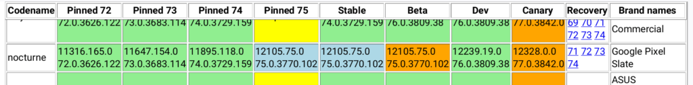

Chrome OS 75 seems to be an oddball of sorts. It was expected to land on Chromebooks about four weeks ago but was late. Then, [the rollout began last week](https://www.aboutchromebooks.com/news/chrome-os-75-stable-version-released-what-you-need-to-know/), only to be [pulled a few days later](https://www.aboutchromebooks.com/news/chrome-os-75-stable-channel-update-release-rollout-paused-for-chromebooks/). Now, at least one device is targeted to receive the Stable Channel of Chrome OS 75.

That device is one of the ones I have: The Pixel Slate, according to the [official Chrome OS release history page](https://cros-updates-serving.appspot.com/) maintained by Google. All other devices are currently still on Chrome OS 74 [per the tip I got from Paul H](https://twitter.com/profhummel/status/1148332166939435008?s=20).

I'm still waiting to hear a response from Google to the query I posed last week on this situation. As of now, there's no official word of why Chrome OS 75 was late or was paused.

If I had to guess, I'd say there were some key issues affecting device functionality. Some folks on the Chrome OS 75 Dev and Beta channel had reported that the Google Play Store couldn't be accessed, for example. Other said they couldn't get their Crostini container to run, meaning they had no access to their Linux apps or data.

Whatever the issue, or issues, hopefully, they've been resolved. Unfortunately, it's not easy for me to tell because my Pixel Slate updated to Chrome OS 75.0.3770.102 as soon as the initial update was pushed. And I haven't seen any of the above issues, nor any other major problems.

You might be disappointed that your device isn't getting upgraded to Chrome OS 75, but testing the rollout on the Pixel Slate is a smart idea for a few reasons.

For starters, there are some updates that could be specific to the Pixel Slate; namely, [a much-improved animation experience in tablet mode](https://www.aboutchromebooks.com/news/chrome-os-75-pixel-slate-tablet-mode-animations-buttery-smooth-overview-lag/), as shown below.

https://youtu.be/4f6j0l9V5\_o

Additionally, there are likely far fewer Pixel Slates in circulation than some of the more popular, or readily available, Chromebooks on the market. This means a smaller number of people would be impacted by any unresolved issues in Chrome OS 75.

Hopefully, the Pixel Slate with Chrome OS 75 shows that the platform update is ready for a wider audience soon. In the meantime, keep an eye on the release history page to see when your device is added to the list.

**_Update at 2:52 pm, July 9_**: Chrome OS 75.0.3770.129 Stable is now rolling out across nearly all supported devices, per the [official Chrome OS release history page](https://cros-updates-serving.appspot.com/).
