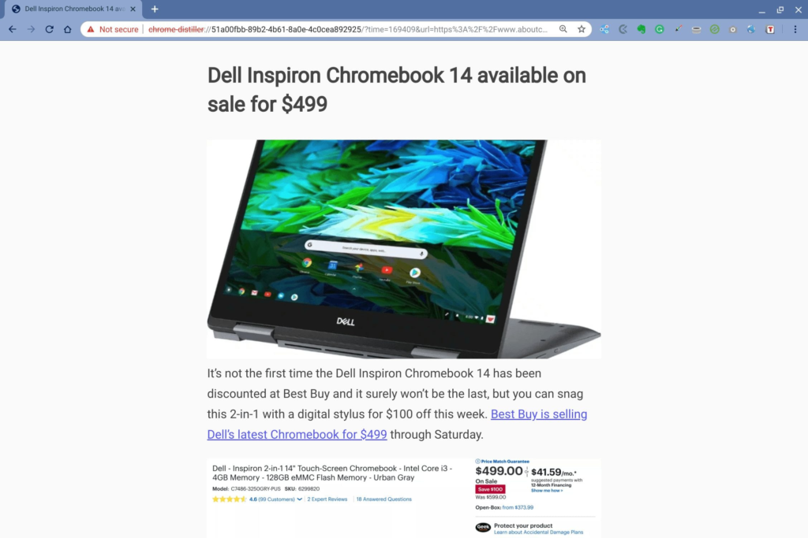

Chrome OS 75 was expected to hit the Stable Channel about a week or two ago, but it didn't. Until today, that is. On Wednesday, [Google began to release the Chrome OS 75 Stable Channel update](https://chromereleases.googleblog.com/2019/06/stable-channel-update-for-chrome-os-m75.html), which will hit devices on a rolling schedule over the coming days.

In terms of release notes, here's what Google says you can find in this new version, some of which I've previously covered and tested:

- Feature to let parents grant more time to their kids on Chrome OS devices
- Enabling kid friendly Assistant for child accounts
- [Linux (Beta) can now access Android devices over USB](https://www.aboutchromebooks.com/news/chrome-os-75-adds-usb-device-adb-android-support-linux-project-crostini/)
- [Files app support for 3rd party file provider apps implementing Android DocumentsProvider APIs](https://www.aboutchromebooks.com/news/chrome-os-75-mounts-android-cloud-storage-to-files-app-on-chromebooks/)
- Add support for [PIN code with native printers for managed devices](https://www.aboutchromebooks.com/news/chrome-os-75-release-enterprise-linux-vpn-pin-code-printing-android-usb/)

Of course, there's more in Chrome OS 75 than the above five bullet points.

For example, this is the version of Chrome OS that [markedly improves the tablet mode animations on the Google Pixel Slate](https://www.aboutchromebooks.com/news/chrome-os-75-pixel-slate-tablet-mode-animations-buttery-smooth-overview-lag/). I captured some of my testing on video so you can see how much better this experience is. There is still room for improvement, but this is a big step forward.

https://youtu.be/4f6j0l9V5\_o

You'll also get [Chrome's version of "reader mode"](https://www.aboutchromebooks.com/news/chrome-os-75-reader-mode-how-to/): When browsing a site, this removes everything but text and images so you can focus on the content. To use it, you might first need to flip the switch at _chrome://flags/#enable-reader-mode_. Then, click the three-dot menu button at the top right of your browser and choose the “Distill page” option for a distraction-free reading experience, such as this:

Google also disabled a feature, at least by default. If you want to use the [Crostini / Linux container backup or restore feature, you'll have to manually enable it in Chrome OS 75](https://www.aboutchromebooks.com/news/chrome-os-76-will-disable-crostini-linux-backups-by-default/). This was originally slated to happen in the next update, but apparently made the cut for version 75.

I'll continue to dig around the release notes and update this post if I can verify [previously reported features](https://www.aboutchromebooks.com/tag/chrome-os-75/) or any other new changes and features additions.
