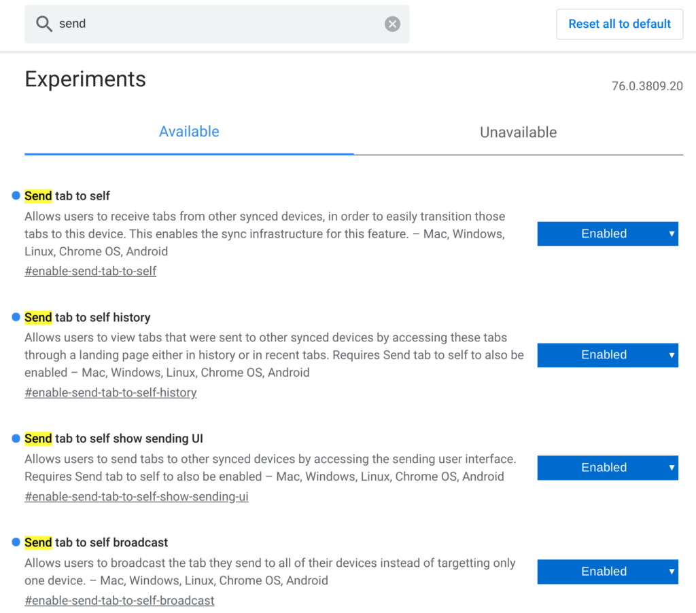
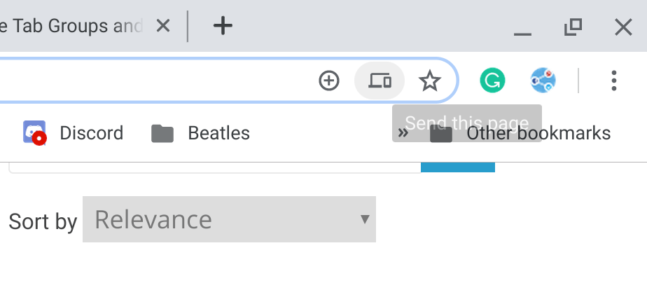
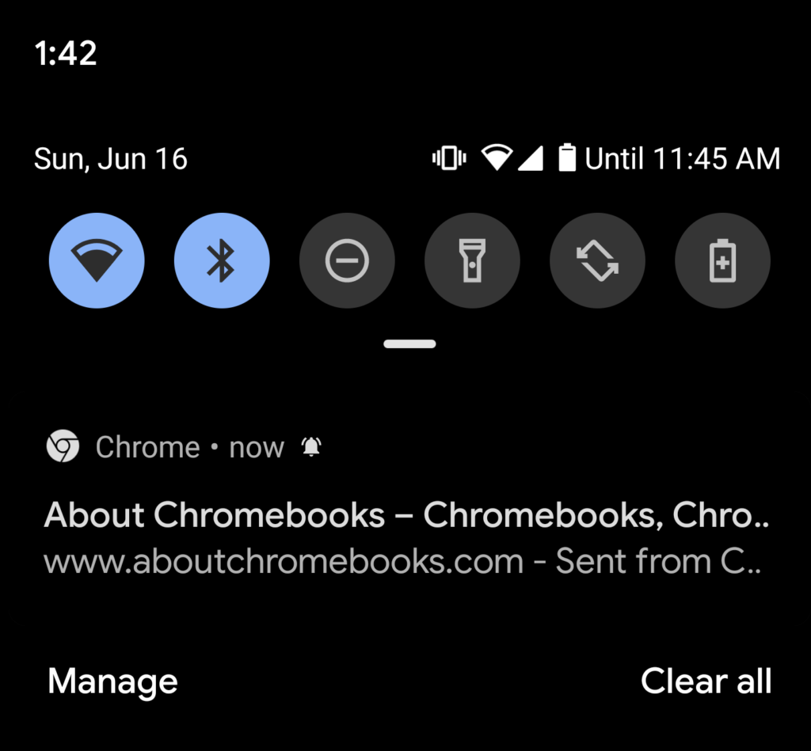

[Chrome Story found a nifty new feature in the works for Chrome OS 76](https://www.chromestory.com/2019/06/update-tab-group-send-to-self/) called "send to self". Basically, it's a simple method to send the URL of a web page from your Chromebook to another device with the Chrome browser.

The flag to enable it, along with other supporting flags can be enabled by opening _chrome://flags/_ and then searching for the term "send":

Although Chrome Story has been testing this on the Canary Channel of Chrome OS 76, I see it on one of my devices running the Dev Channel. And it works as you'd expect.

When you click in the address bar of any web page, you'll see a small icon showing a laptop and a phone. Click it and you can then choose which of your supported devices that will receive the URL. A few seconds later, you should see the URL on that device; in my case, it's from the Pixel 3XL.

Tapping the notification my phone opens the Chrome browser directly to the page I shared. Although both my Pixel Slate and Pixel 3XL are on the same Wi-Fi network in this example, I tested this over an LTE connection on my phone and it worked exactly the same, as you'd expect.

I don't yet see a way to send web pages the other way, that is: from a phone to a Chromebook or other device with the Chrome browser. I think that would be handy as well, so hopefully, Google is working on such a feature.
