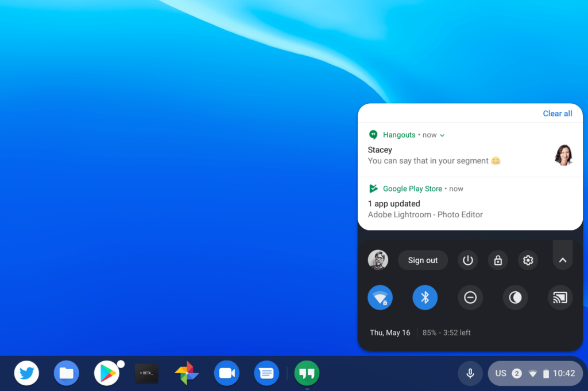

I _can't_ be the only one that generally loathes clearing notifications from a Chromebook. For as long as we could view notifications on the desktop, they stack up and up and up and yet, you had to scroll down, down, down the stack to find that elusive "Clear All" button.

Chrome OS 76 appears to address that with a simple change: The option to clear notifications appears at the top of the stack.

I didn't see any code changes for this user interface change, nor did I have to enable any flags or settings. I just happened to notice it a short time ago after the latest Chrome OS update. After doing a five minute happy dance, I then wrote this up to share the news.

Note that I'm running Chrome OS 76 on the Canary Channel, which gets updates every few days, if not more often at times. It's considered experimental. Still, it provides a good look at upcoming changes that will filter their way through the Dev, Beta and Stable Channels of Chrome OS.

Frankly, I'm not sure why the "Clear all" option was ever at the bottom of the stack. Chromebook users on their device for more than a few hours a day don't have to wait long before notifications can stack up before having to scroll and scroll to clear them.

Maybe the original design was meant to mimic Android, where the option to clear all notifications appears at the bottom of the stacked information. But Android devices are generally a top-down experience with notifications: They float down from the top of the display of a phone or tablet. With Chromebooks, they float up from the _bottom_ of the display so it's more intuitive - at least to me - that the option to clear them should be at the top.
