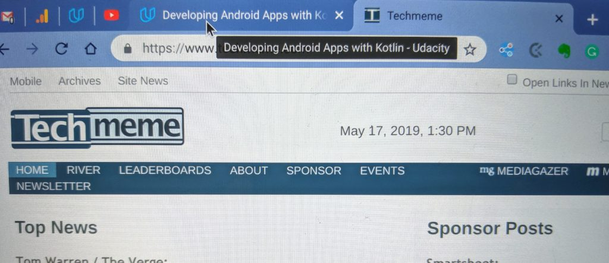
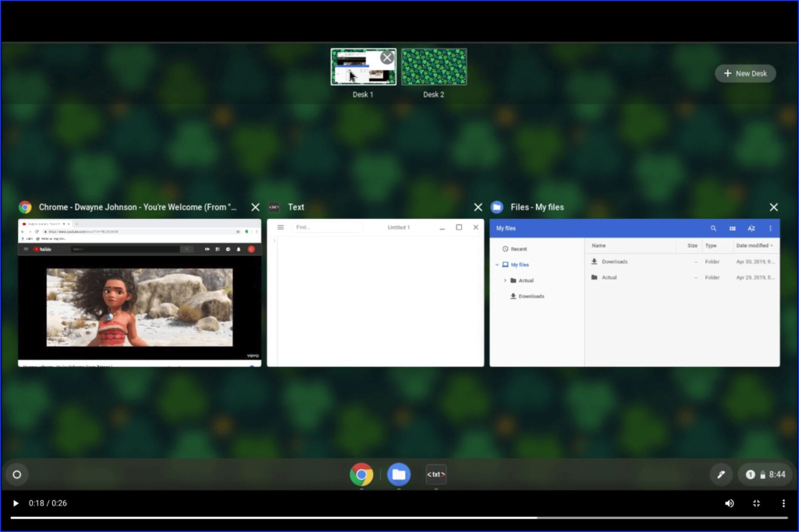

Chrome OS 76, due out in August on the Stable Channel, is shaping up to bring several user interface improvements. On Thursday, I discovered that [the "Clear all" notifications option is moving from the bottom to the top of the notification stack](https://www.aboutchromebooks.com/news/chrome-os-76-desktop-notifications-clear-all-button-top/), for example. And today, I see a key improvement relating to browser tabs in Chrome OS 76 when using the latest Canary Channel build.

First, let's take a look at the information you get from Chrome OS when hovering over a browser tab in Chrome OS 74.

Chrome OS 74 Stable Channel

It's sort of ugly, no? To me it's like the first implementation Google attempted to provide useful data. Sadly, it's been this way for quite some time.

Now take a peek at how browser tab info appears in Chrome OS 76 Canary Channel when hovering over a tab:

Chrome OS 76 Canary Channel

While there really isn't any additional information it looks so much more profession from an OS and user experience perspective. Granted, for folks who don't keep many tabs open at one time, this isn't likely a big deal. But if like me, you end up with several dozen tabs, the newer display is much better, particularly if you pin many of your tabs.

Sure, this is a very small tweak of the user interface. And it's more of Chrome OS catching up to other platforms than breaking new ground.

Still, it's becoming clear that while [new functions and features are in the works](https://www.aboutchromebooks.com/news/chrome-os-75-reader-mode-how-to/) for Chrome OS, [developers are taking the time to improve the interface](https://www.aboutchromebooks.com/news/chrome-os-76-bringing-virtual-desktops-to-chromebooks/) (such as with Virtual workspaces shown below) for a better overall experience as well.

