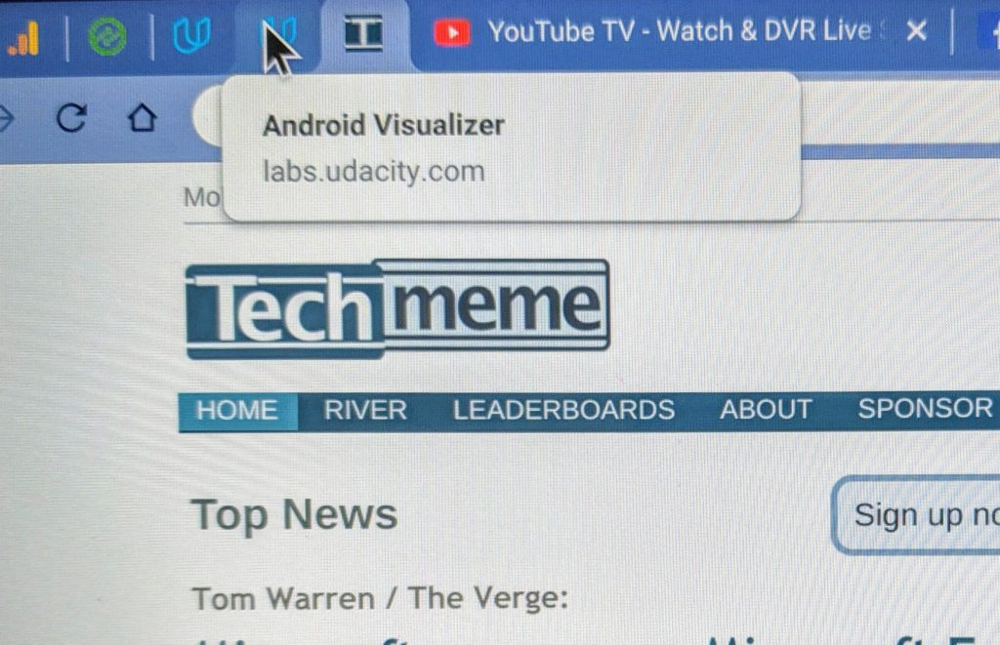

Google announced the [release of Chrome OS 76 to the Stable Channel](https://chromereleases.googleblog.com/2019/08/stable-channel-update-for-chrome-os.html) on Monday, with a staged rollout now underway.

The [original target date for this software platform update was August 6](https://chromiumdash.appspot.com/schedule), so although Chrome OS 76 is a little late. However, this version may be worth the wait due to a large number of features and functions that have been added in addition to bug fixes.

Note that although the rollout has begun today, it may take a few weeks before your Chromebook is updated.

[Google has shared just two of the new features](https://support.google.com/chromebook/thread/11851104?hl=en), so let's get them out of the way first:

- Automatic Clicks: This new Accessibility setting lets you hover or a button or icon in Chrome OS and after a few seconds, the item will be automatically clicked for you. Google says that in addition to a left click "you can now right-click, double click and click and drag" and that this feature works with a trackpad, external mouse and head-tracking devices.
- Media Control: A click on your system menu now shows media playback controls in addition to notifications and system setting shortcuts. I'm actually not a fan of these, so I turn them off using this flag: _chrome://flags?#enable-media-session-notifications_

So what else awaits in Chrome OS 76? [Here's what I've previously reported](https://www.aboutchromebooks.com/tag/chrome-os-76/) with each section heading a link to more details:

[Virtual Desks](https://www.aboutchromebooks.com/tag/virtual-desks/)

I was unsure which Chrome OS version -- [either 76 or 77](https://www.aboutchromebooks.com/news/virtual-desks-chrome-os-76-release-chromebooks/) -- would add Virtual Desks, mainly because developer comments went back and forth between the two. But Virtual Desks did make the cut, and I love them. If you're not familiar with them, they let you create up to four virtual "desktops" to group your browser tabs as well as any Android or Linux apps. I use them to separate personal activities from work and school, for example.

There may have been some small tweaks made to Virtual Desks in this version but [here's what they look like in general](https://www.aboutchromebooks.com/news/chrome-os-77-first-look-at-virtual-desks-video-chromebook/):

https://youtu.be/6EoXhfruZL4

[Send a URL from your Chromebook to your phone](https://www.aboutchromebooks.com/news/chrome-os-76-adds-send-to-self-feature-for-pushing-web-pages-to-your-other-devices/)

For some time you've been able to share a URL from Chrome for Android with other devices. Now, you can reverse it with "send to self". This feature shoots a URL from your Chromebook to your phone, which can be pretty handy for picking up where you left off when it's time to leave the Chromebook behind.

[Linux (aka Project Crostini) backup and restore disabled by default](https://www.aboutchromebooks.com/news/chrome-os-76-will-disable-crostini-linux-backups-by-default/)

I've tested full backups and restores of the Linux container on multiple Chrome OS devices and it works as advertised for me. However, the Chromium team is planning some tweaks to the file format and system that will impact such activities. As a result, the backup and restore function will be disabled by default. If you still want to use it, you can enable it at _chrome://flags/#crostini-backup_

[Improved tab visuals](https://www.aboutchromebooks.com/news/chrome-os-76-improves-tab-information-visuals-on-chromebooks/)

When hovering over a browser tab, Chrome OS looks a little shoddy. It's often difficult to read the tab information that appears, which could cause you to actually open a tab when it's not the one you want. This information looks much better Chrome OS 76 when hovering.

A few other lesser, but still important features in Chrome OS 76 include:

- [Automatic volume button orientation for tablets and convertibles](https://www.aboutchromebooks.com/news/chrome-os-76-volume-button-orientation-tablets-2-in-1-chromebooks/)
- Flash is disabled as previously announced months ago
- The [Chrome OS settings menu now shows all the time when in Settings](https://chromeunboxed.com/small-change-makes-big-difference-in-chromebook-settings-for-chrome-os-76/)
- Progressive Web Apps, or PWAs, will show an installation option the search bar

- A handful of Chromebooks are gaining [GPU acceleration in Linux](https://www.aboutchromebooks.com/news/chrome-os-76-will-make-it-easier-to-enable-gpu-acceleration-on-chromebooks/) by default: Here are the baseboards included, [which you can look up for the device model names here](https://www.chromium.org/chromium-os/developer-information-for-chrome-os-devices).

Note that I haven't yet received the Stable Version on my Chromebooks yet, so it's possible that some of these features didn't make the Stable Channel cut. I'll verify all of them once I have the update and if any of you receive it and find a missing feature, let me know so I can update the post accordingly.
