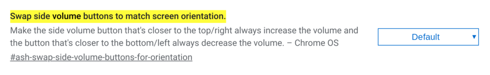

With the front face of Chrome OS tablets looking fairly symmetrical, it can be difficult to quickly tell if you're holding one upside down. That doesn't affect usage of course since the screen contents rotate but it can be a real pain when using volume buttons. I've often hit the volume up button on my Pixel Slate only to see the audio levels decrease.

Chrome OS 76 is addressing this situation by modifying the hardware volume up and down button functionality on Chrome OS tablets so that they work properly no matter how you're holding the device based on [this code commit that is already in the Chrome OS 76 Dev Channel](https://chromium-review.googlesource.com/c/chromium/src/+/1593881).

There's a flag currently required to enable this "rotation" of hardware volume button orientation, which I already turned on for my Pixel Slate:

A quick test shows that no matter how I'm holding my Slate, the volume buttons behave as I'd expect, regardless of portrait or landscape mode and upside down in either position. I assume this functionality change would be present in any 2-in-1 Chromebooks as well when using them in tablet mode.

It's a small but very useful change, making the tablet experience a little less frustrating and should arrive in the Stable Channel of Chrome OS 76 within the first two weeks of August.
