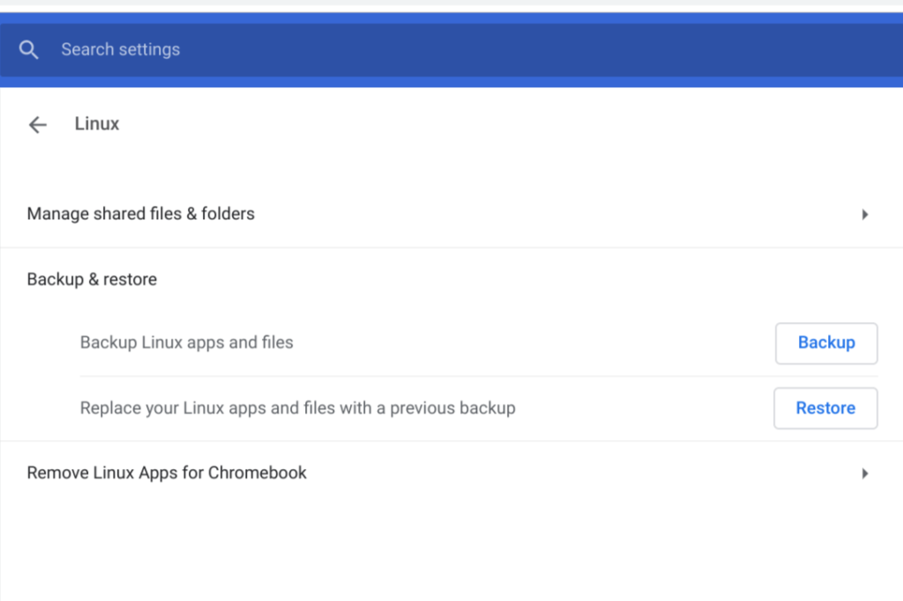

The ability to easy backup and restore the Linux files and data in a Crostini container that arrived in Chrome OS 74 seems to be working well for me. However, Chrome OS 76 will disable the feature by default [based on this code commit](https://chromium-review.googlesource.com/c/chromium/src/+/1666835) I found.

At first, I wondered why such a useful feature wouldn't be enabled by default. After all, functionality to backup and restore is generally considered "table stakes" for any software platform. Then I read the [associated bug report for this change](https://bugs.chromium.org/p/chromium/issues/detail?id=970940) and it explains exactly why this decision was made:

> We don't feel like the feature is ready for prod channel yet, but we are happy to have it on by default in canary and dev. It shouldn't be long until we push it through to prod.

Essentially, this is still a work in progress feature. And I shouldn't be terribly surprised by that, even though in my experience, the functionality hasn't failed me yet.

That's because we know that the Chromium team is considering on a way to [backup and restore Linux containers directly from the Files app on a Chromebook](https://www.aboutchromebooks.com/news/chrome-os-78-restore-linux-chromebooks-files-app-project-crostini/). That proposal is targeted for Chrome OS 78, so this gives the team more time to work that out, as well as any other nits that might not be quite right with the current implementation.

Additionally, the Debian distro of Linux currently used for Crostini is the Stretch version. [Buster is the next iteration and is currently in "testing"](https://www.debian.org/releases/testing/), with [an expected release date of July 6](https://lists.debian.org/debian-devel-announce/2019/06/msg00003.html), which is just around the corner.

I wouldn't think that an upgraded Linux distro would impact the backup and restore functionality since it's really independent of the Linux version; it's all handled by the [LXD container management system](https://linuxcontainers.org/lxd/introduction/). However, any time you introduce a new variable in a complex platform, you never know what might be impacted.

Indeed, there is an open bug to change the default Linux container distro to Buster, which has a tentative milestone of Chrome OS 78. My guess is that with that release of Chrome OS 78, or the next version at the latest, we see the Crostini backup and release functionality enabled by default. Hopefully, the implementation of it in the Files app comes along for the ride.

In the meantime, you can still enable and use the functionality by turning it on at _chrome://flags/#crostini-backup_. Should you fully trust it? That's difficult to say considering the Chromium team doesn't feel it's ready for production. While I take regular backups of my container, I make sure that any data that I can't afford to lose - my Java code for class is a perfect example - is backed up elsewhere in the cloud.

Implementing a linked list stack in Java on the Pixel Slate - yay!
