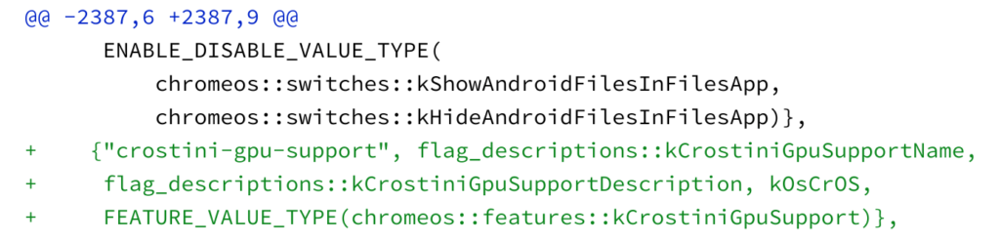

A select few [Chrome OS devices can now use GPU hardware acceleration for Linux](https://www.aboutchromebooks.com/news/pixelbook-and-nami-chromebooks-the-first-to-get-linux-gpu-acceleration-in-project-crostini/), but the feature is currently enabled through a specific command line when starting up the virtual machine for a Linux container. The Chromium team has [an open bug to address this by making it easier to enable and is currently targeting Chrome OS 76](https://bugs.chromium.org/p/chromium/issues/detail?id=892279&q=crosvm&sort=-modified&colspec=ID%20Pri%20M%20Stars%20ReleaseBlock%20Component%20Status%20Owner%20Summary%20OS%20Modified) for the solution.

With that release, there should be a new flag setting found at _chrome://flags#crostini-gpu-support_. I checked for the flag this morning in the latest Chrome OS 76 Canary Channel build, but it's not there yet.

Once it is, you'll be able to flip the switch to enable GPU hardware acceleration in Linux, although it appears the flag may do more than just remove the need to run the --enable-gpu command line manual method.

As it stands now, Chrome OS will also download and install the required cros-gpu-alpha package when firing up the VM terminal with the GPU enabled for Linux. The command line entries for --drm-device and --glamor will also be enabled by default if you enable _chrome://flags#crostini-gpu-support_.

Additionally, once the Mesa 3-D Graphics Library release of mesa-19.1.0 and necessary dependencies becomes official - [planned for later this month](https://www.mesa3d.org/release-calendar.html) - they will be automatically installed, even if your Chromebook doesn't meet the requirements for GPU hardware acceleration. There's a small bit of risk involved in that approach as it could cause issues for non-supported devices, but the team currently thinks the risk is minimal.

Ultimately, after a long wait since the Linux (Beta) feature went live on the Stable Channel of Chrome OS 69, it appears that Chrome OS 76, due in August for Stable, will be the version that fully supports and adds GPU acceleration in Linux on Chromebooks.
