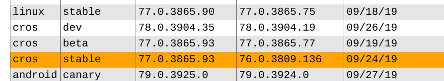
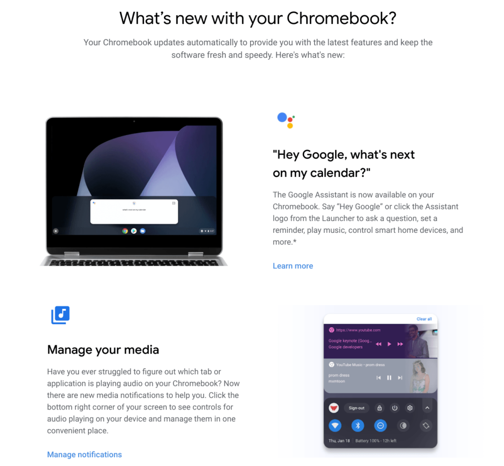
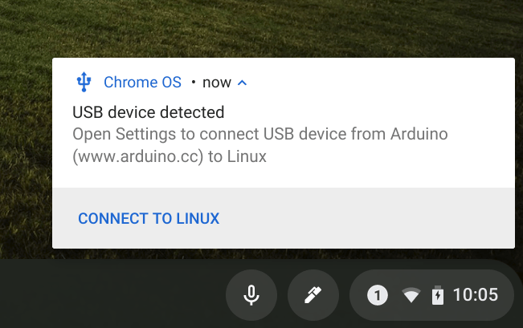
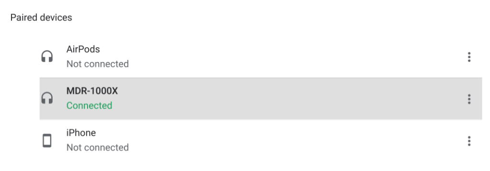

The official Chrome OS 77 Stable Channel is available for most supported Chromebooks, but unless you saw the notification for it on your device, you might not know about it.

Oddly, there's been no announcement on the [Google Chrome Releases blog about Chrome OS 77](https://chromereleases.googleblog.com/), even though it became available on September 24, according to [Google's own Chrome OS update matrix](https://omahaproxy.appspot.com/):

After your device is updated, the [recently added "See what's new" option](https://www.aboutchromebooks.com/news/chromebooks-get-a-dedicated-chrome-os-release-notes-web-page/) - found in Settings, About ChromeOS - offers a glimmer of what's in the updated software, including Google Assistant on more devices (press Search + A on your keyboard after enabling the Assistant), upgraded media management controls, Family Link controls, an updated Camera app and Automatic clicks.

But of course, there's much more in Chrome OS 77. Here are some additional functions and changes [per Google](https://support.google.com/chrome/a/answer/7679408?hl=en) and my own research:

- Ability to launch a Chrome OS device immediately into Guest mode, which can be useful for enterprises and retailers.
- Automatic device shut down after 3 days for Chromebooks with the Linux 4.4 or greater kernel. Again, this is more of a business-related feature than one for consumers.
- HD copy-protected content support for ARC++ apps over HDMI 1.4.
- [Volume control based on orientation](https://www.aboutchromebooks.com/news/chrome-os-76-volume-button-orientation-tablets-2-in-1-chromebooks/) for convertibles and tablets such as the Pixel Slate.
- Improvements to the file formatting options for external media so you can choose between FAT32, exFAT, or NTFS. You can also name the drive.
- For a more consistent user experience, Android apps now open the Chrome OS file selector.

USB support for devices other than Android phones

Earlier this month, I noted [several ways to use an Arduino over USB with a Chromebook](https://www.aboutchromebooks.com/news/how-to-code-an-arduino-with-a-chromebook/) in Linux; I had to because, at that point, the only supported USB devices were technically [Android phones for debugging purposes](https://www.aboutchromebooks.com/news/chrome-os-75-adds-usb-device-adb-android-support-linux-project-crostini/).

Now, additional USB devices may be used, although you'll have to enable this flag: _chrome://flags/#crostini-usb-allow-unsupported_. I did that after updating to Chrome OS 77 and can now natively send code over USB to my Arduino. I can't say which USB devices are or aren't supported without additional testing, so give this a try if you need the feature.

Linux VM updated

I have no idea yet what's included but the first time you open a Linux terminal with Chrome OS 77, you'll likely see that an updated is required. There's no action to take on your part but this could take a minute or two. ProTip: Once the upgrade is complete, run the _sudo apt-get update_ and _sudo apt-get upgrade_ commands to get the latest Linux package updates; I saw several when I did this.

More customizations for the New Tab Page

You'll want to enable both the _chrome://flags/#ntp-customization-menu-v2_ and the _chrome://flags/#chrome-colors-custom-color-picker_ flags for this one but after you do, you have more options for your New Tab Page:

What didn't make the cut:

I expected the [Bluetooth battery indicator to arrive in Chrome OS 77](https://www.aboutchromebooks.com/news/chrome-os-77-to-add-bluetooth-device-battery-level-indicator-to-chromebooks/), but I'm not seeing with either my AirPods or my Sony MDR-1000X headset, even after enabling this flag: _chrome://flags/#show-bluetooth-device-battery_. There's no battery indicator in the Bluetooth settings nor in the system tray. Yet.

I'm sure there's more....

I'm still digging around and will add any major new feature additions to this post in updates. If you've found something worth the mention, be sure to let me know!
