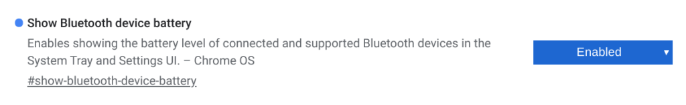

A feature to [show the battery level of Bluetooth devices connected to Chromebooks](https://www.chromestory.com/2019/06/chromebooks-getting-bluetooth-battery-indicators/) has appeared in the Canary Channel of Chrome OS 77, according to Chrome Story. It's not quite working yet, but then again, we are talking about the Canary Channel, which is where code changes drop fast and furious, sometimes on a daily basis.

[This code commit clearly outlines the feature](https://chromium-review.googlesource.com/c/chromium/src/+/1648750), however, so this small but useful feature is definitely in the works. And I enabled the flag for it on one of my test Chromebook devices that is always on the latest Canary Channel version of Chrome OS. When the feature arrives, you'll want to enable this flag: chrome://flags/#show-bluetooth-device-battery

After enabling the feature, I paired my Sony MDR-1000X noise-canceling headphones to the Chromebook and started to stream Spotify over the web. Unfortunately, the battery level indicator of the Sony 'phones didn't yet appear in the Chrome OS status bar, nor in the Bluetooth Settings section. As I said, this is still in progress.

Given the pace of change on the Canary Channel, I wouldn't be surprised to see it working in the next few days, assuming the developers continue to flesh out the functionality.

This is the second Bluetooth-related change for Chrome OS found in the past week. A few days ago, I reported that [a wideband voice codec will be added to Bluetooth support on Chromebooks to enable richer sounding audio](https://www.aboutchromebooks.com/news/chrome-os-wideband-hd-voice-calls-bluetooth-headphones-chromebook/) during a voice chat.

While these are both steps forward for Bluetooth device support on Chrome OS, I continue to hear from many readers that Bluetooth in general has been poor on their Chromebooks, with many random disconnections or other issues. Hopefully, the Chromium team continue to strengthen basic Bluetooth support for the platform because, let's face it: All of the interesting and useful new Bluetooth features in the world aren't worth much if the Bluetooth connection isn't bulletproof.
