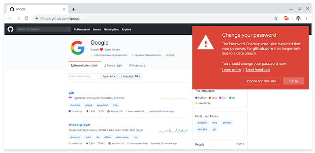

If you subscribe to a service such as "[Have I Been Pwned?](https://haveibeenpwned.com/)", you know when an online password you use has been compromised in a data breach. The free service sends you an email when a password database has been cracked, or inadvertently left wide open, so you can then change your credentials.

Chrome OS 78 appears to be bringing a similar feature called "Password Leak Detection" [according to Techdows](https://techdows.com/2019/08/google-chrome-gets-password-leak-detection-feature.html). And although it's coming to Chrome OS, it will also work in Chrome for macOS, Windows, and [even Android notes XDA Developers](https://chromium-review.googlesource.com/c/chromium/src/+/1746251).

[This bug in the Chromium commit](https://bugs.chromium.org/p/chromium/issues/detail?id=986317) is tracking progress if you want to keep up with the feature in development. However, the experimental flag (_chrome://flags/#password-leak-detection_) is already appearing in the Canary Channel of Chrome OS 78.

If all of this sounds like Google's Password Checkup extension, it is. The company last week shared what it has learned from the usage of that extension and also updated the extension (shown below).

> The extension displays a warning whenever you sign in to a site using one of over 4 billion usernames and passwords that Google knows to be unsafe due to a [third-party data breach](https://security.googleblog.com/2017/11/new-research-understanding-root-cause.html).
> 
> Since our launch, over 650,000 people have participated in our early experiment. In the first month alone, we scanned 21 million usernames and passwords and flagged over 316,000 as unsafe---1.5% of sign-ins scanned by the extension.

The main difference I can see with Password Leak Detection is that the feature will be built into the platform, which means Google will learn even more about used passwords and can then better protect users.

Note that the Password Checkup extension now allows you to opt-out of sending such data to Google; I hope that option is still available when Password Leak Detection arrives.
