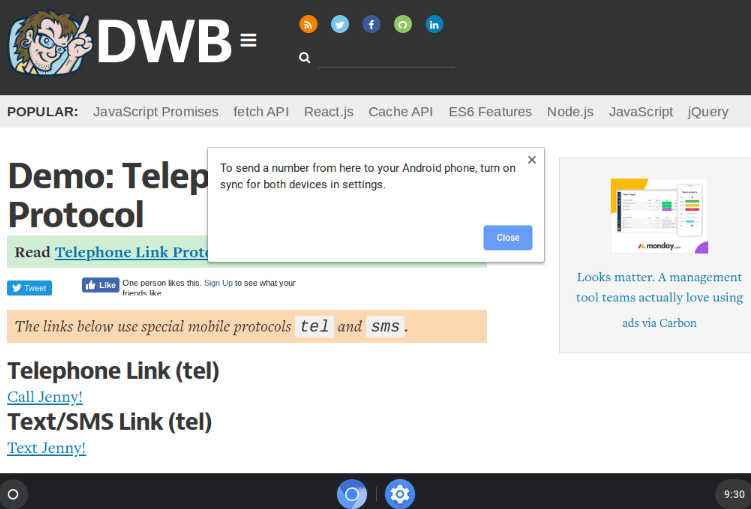
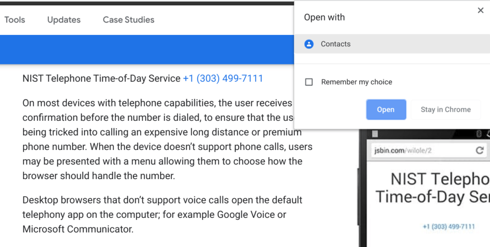

Earlier this year there were [references to a "Click to call" feature for Chromebooks](https://9to5google.com/2019/02/22/google-chrome-click-call-android/) and it appears that [Click to call will arrive in Chrome OS 78](https://crbug.com/1007995). Code changes targeted for the next Stable Channel version of Chrome OS show some of the user interface, particularly when you _don't_ have an Android phone connected to your Chromebook.

With Click to call, you'll be able to tap a phone number hyperlink on your Chromebook, which will automatically place the call on a supported Android phone.

It looks to me like users _may_ not have to do anything new on the Android side to enable this feature: If you've already connected an Android phone in the Chrome OS settings for Instant Tethering, for example, this could just work. I say "could" because the above error message indicates that both the Chromebook and Android phone must have synchronization settings enabled.

Regardless of the implementation, I think most Chromebooks users will find Click to call very handy. Sure, there are third-party apps, services, and web extensions to place calls over the web in a similar fashion. And those can be just as handy. But sometimes, you need to place a phone call on an actual phone and walk away from the Chromebook.

By the way, if you click on a telephone link today, you get the above rather odd popup to use a Contacts app. It looks like the "plumbing" to do something with a hyperlinked phone number has been around for a while.
