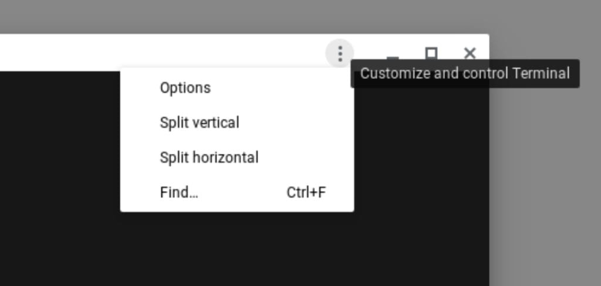

Folks who use [Linux via Project Crostini](https://www.aboutchromebooks.com/tag/project-crostini/) on a Chromebook will be happy to hear this news: The Terminal app is planned to be a first-class citizen system app in Chrome OS 78.

This means that Terminal use will no longer appear in your Chromebook's browsing history. And it really shouldn't: Terminal use isn't the same as general browsing in Chrome OS.

My browsing history from this morning. Terminal?!?

Even better, an early look at the updated Terminal app shows in-app options and multiple tabs for different Terminal sessions.

The details are in [this bug report](https://bugs.chromium.org/p/chromium/issues/detail?id=846546) which was opened back in May of last year, currently slated to make the Stable Channel release of Chrome OS 78 in about 6 weeks time. As you read through the commentary, you can see that the current Terminal implementation was really aimed at getting [Linux support out the door in 2018](https://www.aboutchromebooks.com/news/chrome-os-69-stable-release-project-crostini-linux-apps/); not as a long term, best-in-class solution:

> The Crostini Terminal is current running crosh (a v1 app) with some hacks to make it not get picked up in the shelf as crosh. We should try and avoid these hacks, for example moving crosh off the legacy app system and making separate PWAs for crosh and the terminal.

This change will be welcome as the current implementation has basic, limited functionality. For example, you can't group multiple Terminal sessions in a single window today. Instead, you have to open up separate Terminal instances, making it difficult to track which one you want to use or switch between them.

Updated Terminal app with new options

The new design prototype, shown last month, allows you to group all Terminal sessions in a single window, however. And it also provides options to split the screen either horizontally or vertically as needed.
