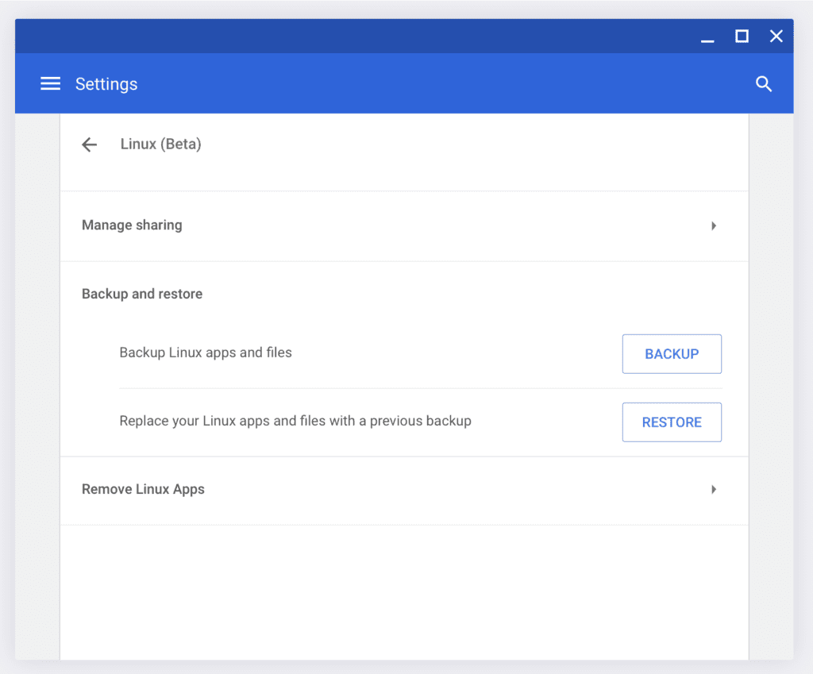

[Chrome OS 74 brought the ability to backup and restore Linux containers](https://www.aboutchromebooks.com/news/chrome-os-74-stable-version-arrives-heres-what-you-need-to-know/) on a Chromebook. It's handy and [it works](https://www.aboutchromebooks.com/news/what-linux-backup-restore-for-chromebooks-user-interface-chrome-os-74/). However, to use it, you have to go to the Linux settings in Chrome OS, which isn't ideal.

Linux backup and restore in Chrome OS

That may be changing in Chrome OS 78 with a more intuitive place to find previously backed up containers and then restore them.

I noticed a bug report that's currently tagged with a Chrome OS 78 target and it suggests [using the native Files app for the Linux container restore process](https://crbug.com/972848):

> Use file format chromeos-linux-YYYY-MM-DD.tini for crostini backup images.  
>   
> Associate this file type in FilesApp with a dedicated icon and action to start the restore process.

Essentially, this sounds similar to the method used to [install Debian packages in the Files app](https://www.aboutchromebooks.com/news/how-to-install-debian-linux-packages-in-project-crostini-chrome-os-files-app/): For that, you right click on the package and see an "Install with Linux" option.

The difference here is that an option would be made available either in a contextual menu or the "dedicated icon" attached to the container backup so you can begin your restore.

There are two other bugs and changes that may hold this functionality up at the moment; the developer suggests waiting for [mounting .tgz files and viewing their contents](https://bugs.chromium.org/p/chromium/issues/detail?id=815103) first. So it's worth keeping an eye on progress for those efforts - which will also be handy features - before this improved user experience for container restorations is implemented.

Of course, it may never be implemented, which is part of the challenge when viewing Chrome OS bugs and feature requests. Unless there's a technical reason that holds this up, however, I'd expect it to move along and eventually arrive in the Stable Channel. Anything Google can do to improve the Linux experience on a Chromebook is a win in my book.
