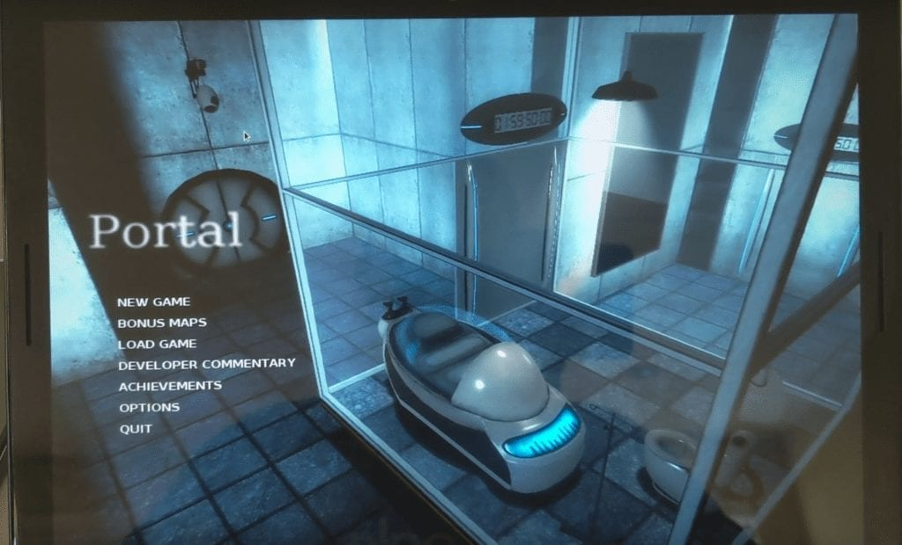

Earlier this week, [Google announced that Chrome OS 78 has arrived for the Stable Channel](https://blog.google/products/chromebooks/whats-new-november2019/) and is currently rolling out to Chromebooks. The official blog posts notes four key features:

- **Virtual Desktops with keyboard shortcut support**: While this feature has been around for several versions, it was experimental until Chrome OS 78. You no longer need to enable Virtual Desks via a Chrome flag. Additionally, the official keyboard shortcuts have been shared:  
    _\- Create a new Desk with “Shift” + “Search ” + “=”  
    \- Switch between Desks with “Search ” + “\]”   
    \- Move windows between Desks with “Shift” + “Search ” + “\]”_  
    Note that a three-finger swipe moves between desktops while it now takes a four-finger swipe to move between open tabs.  
      
    Here's a recap of my early look at this useful feature:

https://youtu.be/6EoXhfruZL4

- **Click-to call:** If you have a connected Android phone and click a linked telephone number on a web page, you can make the call directly from your phone. Note that before I connected my handset to a Chromebook, I also had the option to place the call via Hangouts with this version.
- **Improved user experience for printing:** Google says you can simply press _"Ctrl + P"_ to initiate printing at any time and that the printer setup process is easier.
- **An easier way to submit Chrome OS feedback.** You can now tap your Chromebook's power button to see the new Feedback option.

Of course, there are additional features in Chrome OS, although some are still experimental:

## Linux backups still disabled by default but can be restored through Files

If you want to [backup and restore your Linux container with Chrome OS](https://www.aboutchromebooks.com/news/what-linux-backup-restore-for-chromebooks-user-interface-chrome-os-74/), you'll need to enable the feature at _chrome://flags/#crostini-backup_. New to this function, however, is a new file format for the backup and the ability to restore your backup through the native Files app.

## YouTube for Android Picture in Picture (PIP) support

I tend to use YouTube in my Chrome OS browser but if you prefer the Android version of YouTube, you can now [use PiP on your Chromebook, per 9to5Google](https://9to5google.com/2019/11/06/chrome-os-78-stable/).

## GPU hardware acceleration for Linux enabled by default in Crostini

There's no longer a flag or command line needed to [enable GPU hardware acceleration for Linux](https://www.aboutchromebooks.com/news/video-pixel-slate-portal-steam-with-gpu-acceleration-chrome-os-76-chromebook/) on supported Chromebooks as the feature is [now enabled by default](https://bugs.chromium.org/p/chromium/issues/detail?id=1007042).

## Send text from a Chromebook to other devices via a synchronized clipboard

This feature is experimental, so you'll need to enable it through [a trio of flags](https://www.aboutchromebooks.com/news/first-look-at-the-shared-clipboard-feature-coming-to-chrome-os-78/) but once you have it, you can select text on your Chromebook and send it to other devices. In the below example, the copied text on my Chromebook was sent to the clipboard of my Pixel 4 phone.

I'm sure there's more in Chrome OS 78 that I haven't yet found so I'll keep looking. In the meantime, drop a comment if you've seen any additional features.
