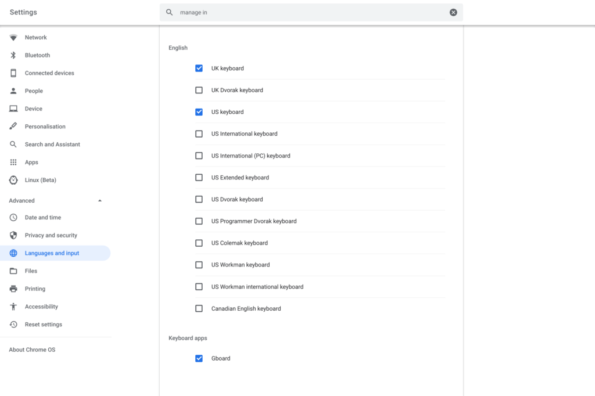

I know that Chrome OS had a flag for Android input methods a few versions back but that flag was removed. It appeared that Android keyboards were or would be supported on Chromebooks with the flag but I haven't had any luck adding any. However, Phillip tipped me over email that the [Chrome OS 79](https://www.aboutchromebooks.com/tag/chrome-os-79/) Dev Channel is supporting Android keyboards; at least when in Tablet Mode.

I'm not currently running the Dev Channel so I haven't tested this but Philip did send me screenshots of his successful GBoard installation; no special flag or setting was required.

Obviously, you need to have a third-party Android keyboard installed from the Play Store on your Chromebook for this to work. Once you do, however, you can choose it in the Chrome OS Keyboard Input Settings:

Based on Phillip's experience, it appears that this is still a work in progress of sorts:

> One thing to note I have found is after a reboot you might have to click on Gboards Android app to make it available again and select input method as Gboard from inside the Android app then it will appear as an input method in Chrome OS.   
>   
> Also if you have a convertable (like my Pixelbook) if you use the physical keyboard and then switch to tablet mode it will reset back to the Chrome OS keyboard and you have to re-select Gboard.

So, yeah. It's not quite ready for daily use on most devices just yet unless you can live with the keyboard getting reset after using a physical keyboard. Still, it's progress for those who want to use GBoard, SwiftKey or some other software keyboard on their Chrome OS tablet or 2-in-1. Thanks, Phillip!

**_Update at 1:45pm, 10/28/2019_**: I can't currently test at the moment, but this might work on the current Stable Channel, at least on a Pixel Slate:

https://twitter.com/alexchapinGreen/status/1188843940998537217?s=20
