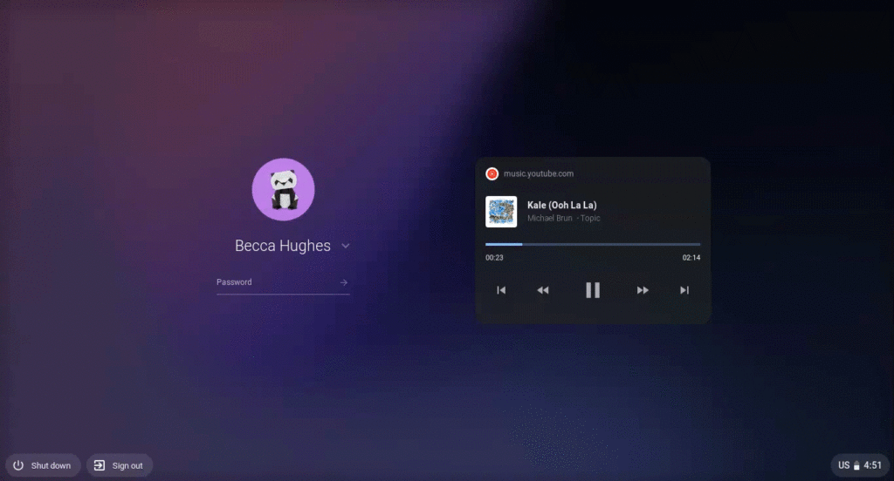
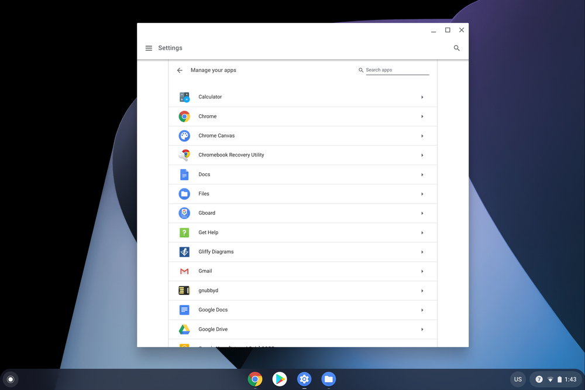
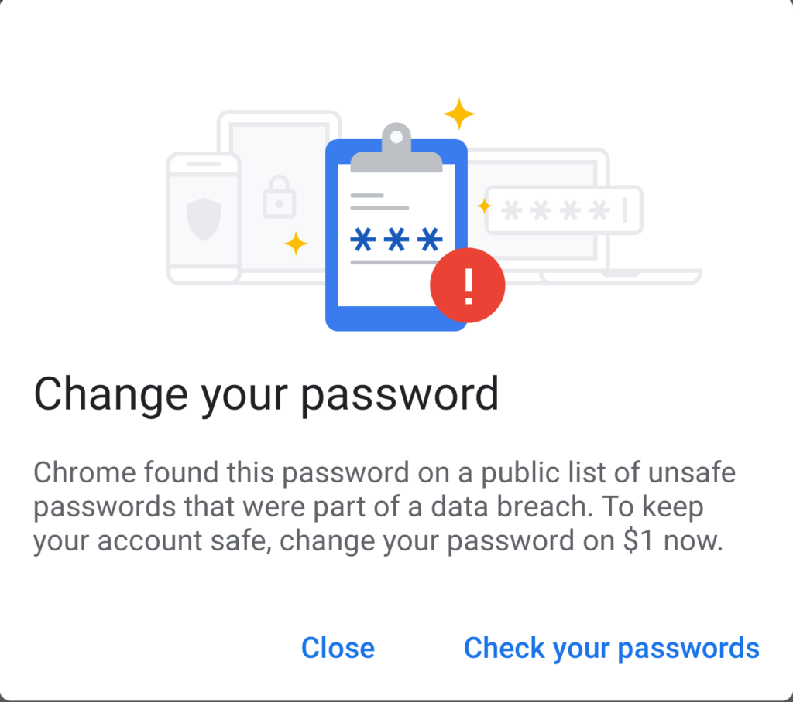
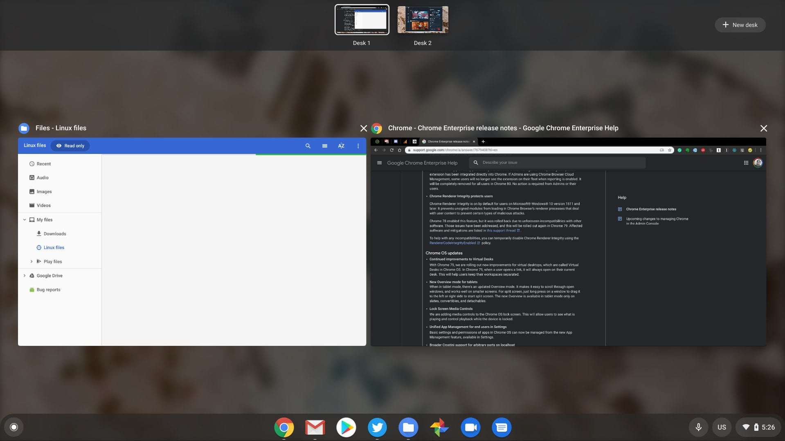
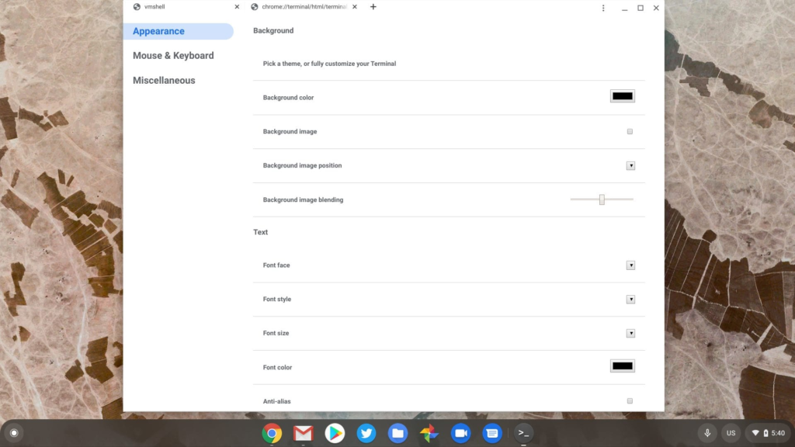

Right on time, [Google on Tuesday announced that Chrome OS 79 is now available in the Stable Channel for Chromebooks](https://blog.google/products/chromebooks/whats-new-december2019/) and other Chrome OS devices.

Oddly, this release isn't getting much fanfare in the announcement, as it focuses solely on a pair of features. And we all know there's always more goodies in a full version Chrome OS release.

Let's get the two highlighted features out of the way first. To start is support for audio media controls on your Chromebook lock screen.

Google says the new feature works with "YouTube Music, Spotify, iHeartRadio, dozens of other apps, and any media played through Chrome browser."

Next up is a more granular method to manage installed apps and the permissions those apps have. Hit up your Settings page and you'll see the new "Manage your apps" option. Choose it and you can see all of your installed apps along with options to manage the individual permissions for each.

To see [what else is in Chrome OS 79, you can hit up the log file on the official Chrome Releases blog post](https://chromereleases.googleblog.com/2019/12/stable-channel-update-for-desktop_17.html), which is pretty tedious. I've been tracking this release for weeks, so here's what else I've found in the software update so far based on that effort and the [recently published notes on the Chrome Enterprise site](https://support.google.com/chrome/a/answer/7679408?hl=en).

For starters is the [new Password Checkup feature](https://www.aboutchromebooks.com/news/password-checkup-in-chrome-os-79-warns-of-stolen-online-credentials-heres-how-it-works/) that got some good press when it was announced alongside Chrome 79 last week.

If you missed that news, Chrome OS essentially is now comparing your online account credentials against a database with more than 4 billion known cracked passwords. You'll be prompted to change your credentials if you use any of the stolen accounts and you can also run a scan of your passwords at any time.

A small update to [Virtual Desks](https://www.aboutchromebooks.com/tag/virtual-desks/) arrives in Chrome OS 79: When you click a link on a web page, it will open in the currently active desk instead of switching to a different one.

Overview mode gets a fresh coat of paint in Chrome OS 79 also, but it's limited to devices with a tablet mode such as pure Chrome tablets and 2-in-1 convertible Chromebooks. This mode has smaller thumbnails which are better for smaller screens.

Crostini, or Linux for Chrome OS, gains an important useful feature when it comes to local server ports. Prior to Chrome OS 79, there was a very small range of whitelisted ports for this use case. Now, any port can be used.

Speaking of Crostini, the [new Terminal app](https://www.aboutchromebooks.com/news/chrome-os-78-expected-to-elevate-terminal-to-a-system-app-with-tabs/) isn't quite ready. You can hit _chrome://flags/#terminal-system-app_ to enable it but at time of writing, it won't start a Linux instance.

When it does arrive and work you'll be able to tabs open in a single instance and split your Terminal either horizontally or vertically. And the customization options will be easier to find; just click the three dots at the top right to see them.

Also not making the cut but expected for Chrome OS 80 are the new tab grouping and tab freezing features. The former is pretty self explanatory and the latter will essentially pause unused tabs left open for five minutes. At that time, they won't be running any tasks in order to reduce CPU and memory usage.

I'll continue digging through the log for other changes but if you see any, please share in the comments!
