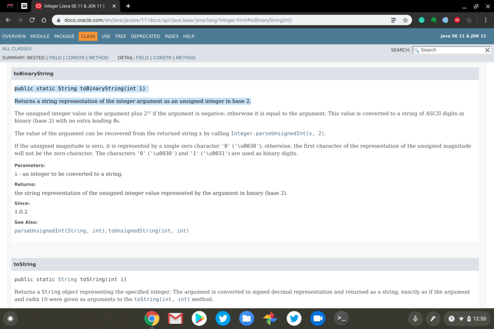

The Chromium team is working on a new feature for Chrome OS 79 that should improve general Chromebook performance when using Linux apps. If the code changes are completed and succesfully tested in time for Chrome OS 79, any [Linux apps running in the background would see "throttling" down by the CPU](https://bugs.chromium.org/p/chromium/issues/detail?id=997397), allowing more processing power applied to foreground apps such as the web browser.

This approach actually isn't new: According to the bug report and code changes to date, Chrome OS already does this for any Android apps that don't have the user focus. The Chromium team is reusing that approach for a broader approach of performance improvement:

> Refactor ArcThrottleObserver into ThrottleObserver.  
> This change, in preparation for addition of crostini throttling, moves  
> the ArcThrottleObserver class to chrome/browser/chromeos/ and renames it (and all usages) to ThrottleObserver. This is because the class  
> is no longer ARC++-specific. Additionally, moves WindowThrottleObserverBase to chrome/browser/chromeos/

I use Linux apps in Crostini quite a bit, and until now, thought my time in them is fairly dedicated. That is, I didn't think I often switched out of a Linux app to do something else. But then I thought a little deeper.

While I don't typically jump from a Linux app to Android software, I do jump back and forth to my Chrome OS browser quite a bit. I'm often using an Integrated Development Environment (IDE) to code for my CS classes in Linux and tend to look up details on a particular API or other information needed for my coding.

Here's an example of when I need to convert an integer to a binary number for an assigment:

This type of browsing activity doesn't require much horsepower but it would be nice to have more CPU resources focused on my task at hand. And I'm sure there are plenty of folks that could use more processing power for an Android app or two when they also have Linux running in the background on their Chromebooks.

By the way, if you're curious about what system performance tool I'm using in the top image, it's a [Chrome Web Extension called Cog](https://chrome.google.com/webstore/detail/cog-system-info-viewer/difcjdggkffcfgcfconafogflmmaadco?hl=en). I use it on all of my Chromebooks to measure and monitor CPU usage as well as memory.
