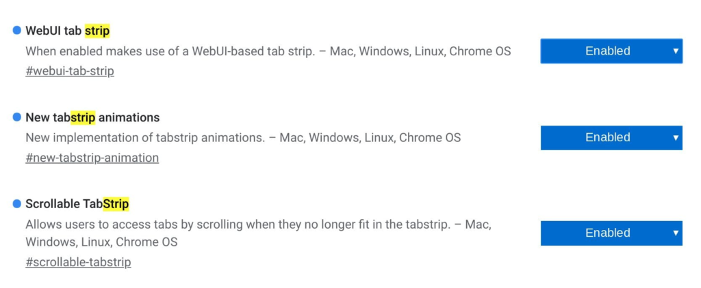

Back in October, [Chrome Story reported on a new "tab strip" interface](https://www.chromestory.com/2019/10/chrome-tab-strips/) to make switching between tabs a little more finger-friendly. The functionality is [currently targeting a Chrome OS 80 implementation](https://crbug.com/989131) and while it's still a work in progress, the developers have been very active lately.

If you're not familiar with the user interface, it is currently working on the Dev Channel of Chrome OS 79 where I took a look at how it's coming along.

To see it for yourself, you'll need to enable these flags and restart your browser:

Once restarted, the browser should show a plus sign and a small up arrow at the top right; tapping plus opens a new tab while tapping the arrow brings the new tablet-optimized overview mode:

Tab Strip mode in Chrome OS 79 Dev Channel

In its current form, it's clear you won't want to use this with an attached keyboard, say on the Pixel Slate. You can't scroll through tabs using trackpad gestures when the tab-strip feature is active.

Attaching the keyboard doesn't switch tab-strip functionality off, at least not yet. I hope that's a feature that gets added for folks that switch between desktop and tablet mode on their 2-in-1 Chromebook.

That's because the Chrome OS browser goes into full-screen mode with the focus solely on the current tab in this mode. So you have to click the tab-strip arrow and then tap the tab you want. Scrolling left or right shows all of the currently open tabs.

The plan is also to support tab movement through drag-and-drop functionality but that's not working for me at this time. Clearly, this is still a work in progress.

Regardless, I'm looking forward to seeing the final interface here as I anticipate it will not just work on pure Chrome OS tablets such as the Pixel Slate, but all 2-in-1 Chromebooks when in tablet mode.
