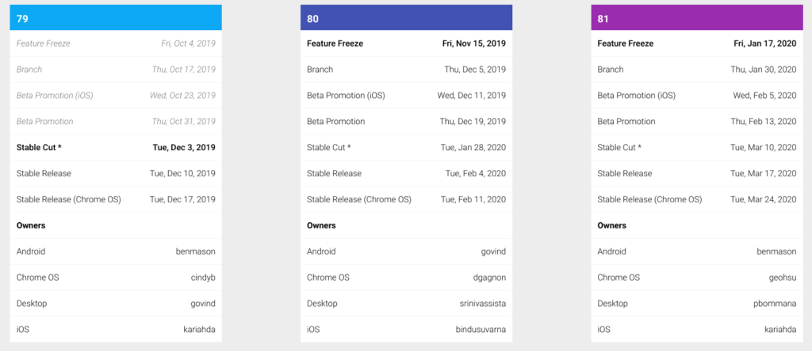

Back in July when Debian Linux was officially updated from version 9, called Stretch, to Buster, version 10, I noted that [Chromebooks weren't ready for this upgrade in their Crostini container](https://www.aboutchromebooks.com/news/linux-debian-10-buster-upgrade-chromebooks-chrome-os-project-crostini-how-to/). Sure you can manually update the Linux distro on your Chromebook, but you run the risk of certain Chrome OS-specific integrations breaking.

Since then, the Chromium team has made [great progress in preparing Chrome OS for an upgrade to Buster](https://crbug.com/930901). And the current plan is to support that upgrade in [Chrome OS 80, currently scheduled for release in February](https://chromiumdash.appspot.com/schedule).

Aside from scores of code commits to ensure a smooth upgrade in the Linux container, [a new experimental flag to test the upgrade](https://bugs.chromium.org/p/chromium/issues/detail?id=930901#c46) over the coming months was added just this week. When it arrives, you'll be able to enable the _chrome://flags/#crostini-use-buster-image_ setting to have your container use Buster.

Also, completed this week was [work on Tremplin](https://chromium.googlesource.com/chromiumos/platform/tremplin/+/43bf1b749746f5519f01812de01294f5c58020f0). If you're not familiar with Tremplin, it's pretty integral to the Crostini implementation for Linux containers on Chromebooks. From the official Chrome OS documentation:

> Tremplin is the “springboard” daemon that runs in the Termina VM and exposes a gRPC interface for managing LXD containers.

I'm still sorting through all of the code commits here, and I'm sure there will be many more for this feature request, but near as I can tell right now, the [Buster](https://www.debian.org/releases/buster/releasenotes) upgrade will be just that: An _upgrade_ if you already have Stretch installed.

My initial concern when I first saw this request was that current Stretch users might have to do some type of import/export of data after the upgrade. So far that doesn't appear to be the case. And frankly, that shouldn't be the case since the system and user files are separate.

I'll keep reading the commits and following the forthcoming progress so I can tell you when the new flag is available.
