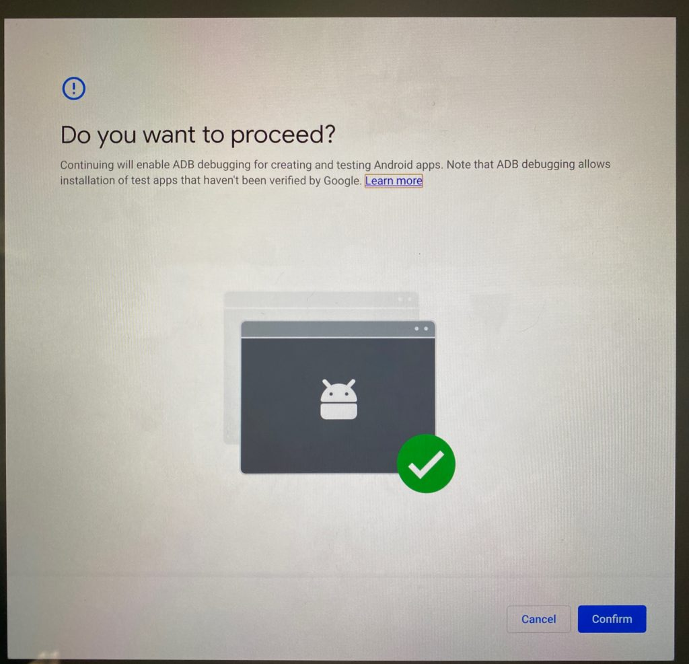
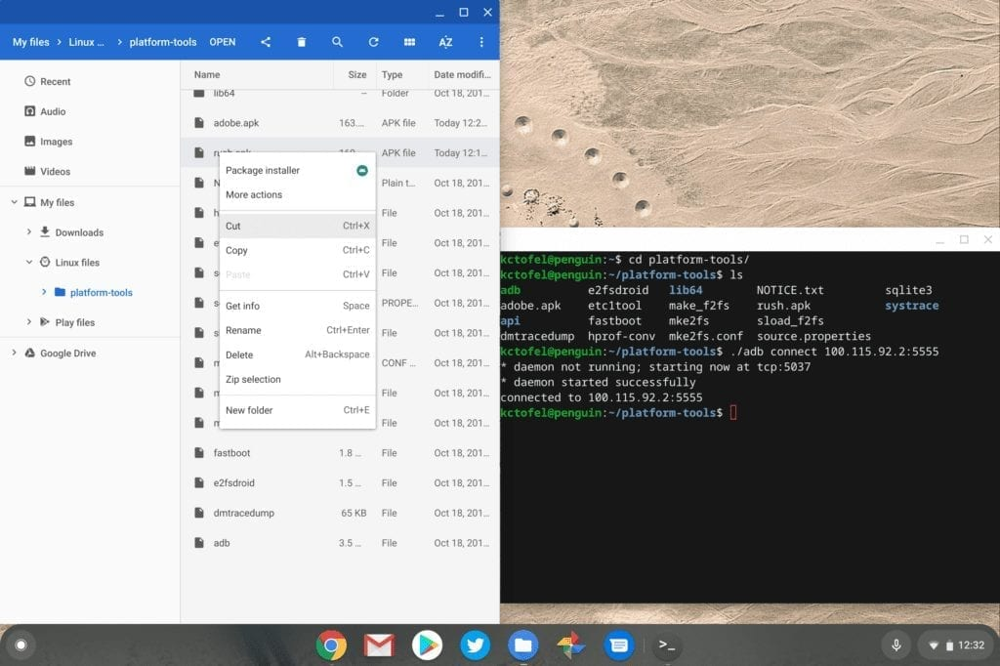
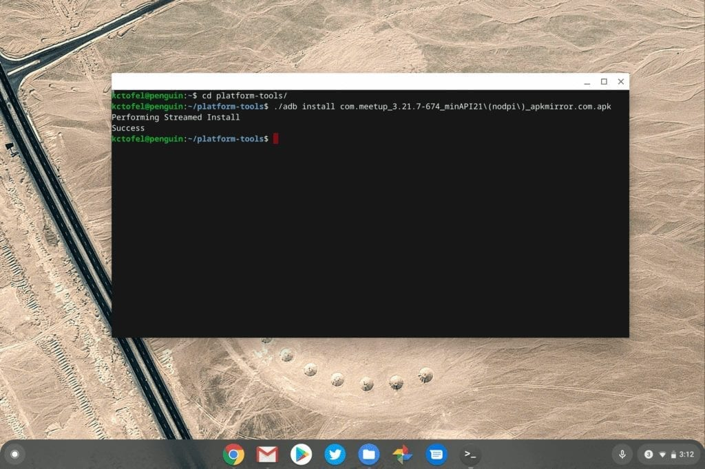
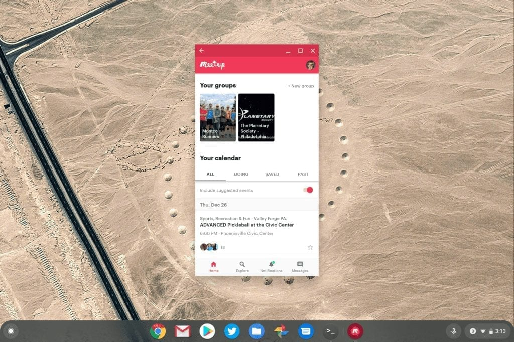

We knew that some form of [Android app sideloading was coming to Chrome OS](https://www.aboutchromebooks.com/news/chrome-os-80-to-bring-arc-sideloading-of-android-apps-to-chromebooks/) and the latest Dev Channel version shows that it's nearly here. I was able to use Chrome OS 80 to sideload several Android apps on a Google Pixel Slate.

Before showing the steps I used, with [key ones coming from Redditor magick\_68](https://www.reddit.com/r/Crostini/comments/ed6ss0/you_can_now_access_the_android_container_from/), a few words of caution and explanation.

Google said in October that this feature is **_not_** intended for users to install Android apps to a Chromebook from outside of the Google Play Store. Instead, it's meant for developers who use [Android Studio to build Android apps on Chromebooks](https://www.aboutchromebooks.com/news/android-studio-chrome-os-chromebook-recommendation-google-io-2019/), and then "push" it to the Android container within Chrome OS for testing.

Additionally, while this technique does not require you to reduce security by putting your Chromebook in Developer Mode, it does bring some additional security risks. So proceed at your own caution and make sure you're comfortable with your source(s) for Android app packages.

Having said all that, you'll need Chrome OS 80 Dev Channel installed as well as [Google's Android SDK Platform Tools installed in Linux](https://developer.android.com/studio/releases/platform-tools) on your device. These tools include ADB, or Android Debug Bridge, typically used to connect a computer to an Android phone for debugging purposes.

You'll also need to enable ADB Debugging under the Develop Android apps section in the Linux settings of Chrome OS.

You'll be prompted if you're sure you want to do this and if you accept the prompt, your device will restart.

You'll also see a warning message on your lock screen going forward, letting you know that apps from outside of Google Play may be on the device.

Once you're all set up and have downloaded an Android APK file to install, you start up an ADB server with the following Terminal command: _adb connect 100.115.92.2:5555_ This essentially connects your terminal to the ARC, or Android container as if it were a physical device.

After that, a simple ADB command to install your downloaded Android app is all you need. In this example, I installed MeetMe even though it's available in the Google Play Store.

ADB install command

Success!

Now I can't vouch for every sideloaded app to work, of course. In fact, just for kicks, I installed the Samsung Internet Browser. The install completed without errors, but the browser tabs reload in a loop, making the software unusable. Keep that in mind if you go down this path.
