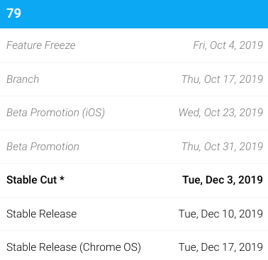

Lately, I've been using an external monitor with the [Pixelbook Go](https://www.aboutchromebooks.com/news/pixelbook-go-review-a-premium-price-validated-by-a-premium-device/) for testing purposes and didn't realize that Chrome OS notifications don't quite work correctly.

According to [an open bug report](https://bugs.chromium.org/p/chromium/issues/detail?id=1019289), when a notification pops up it does appear on both the internal and external displays but isn't always actionable on the external monitor:

> when there's a screenshot or a file downloaded, the notifications mirror on both the internal and external display.  
> \- But for screenshot, you can't press COPY on the external monitor. You can on the internal monitor for the same notifications.  
> \- For file download, you can't OPEN on the external monitor. You can on the itnernal\[sic\] monitor.  
>   
> So, everything appears but you just can't press on that buttom. The  
> dismissal X on the top right of the notification is OK on both internal and  
> external notifications.

Initially, the bug appeared specific to the Pixelbook Go, but subsequent testing has replicated the issue on other Chromebooks.

As it stands now, a fix is planned for Chrome OS 79 although it's rather late in the software release cycle for that to happen.

I say that not just because [Chrome OS 79 is expected to land in mid-December](https://chromiumdash.appspot.com/schedule), but also because there aren't yet any code changes to actually fix the issue as of today.

My expectation is that Chrome OS 80 will correct this problem, although it's possible that code is quickly written and tested in Chrome OS 79. If you want to track this progress, you can star the bug report for updates.

I know I'm late to the game when using an external monitor with a Chromebook but that's mainly because I never felt the need to. Since taking some online coding courses, however, the dual-monitor setup is a huge efficiency booster. On my internal Chromebook display, I watch step-by-step video lessons and on the larger external display, I add and test code, providing me more room to navigate many lines of code.
