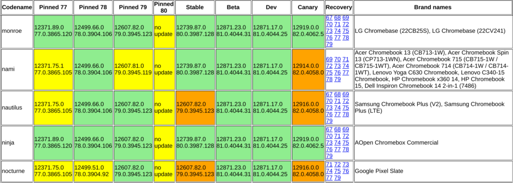
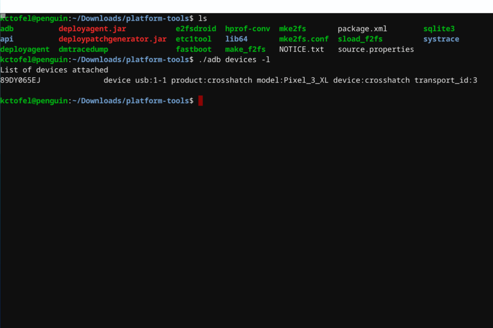

Initially expected around February 11, Chrome OS 80 has landed on the Stable Channel for Chromebooks today. As of time of writing not all Chrome OS devices are seeing the update, so per usual, you'll want to be patient. You can [check which devices are receiving the update on this matix](https://cros-updates-serving.appspot.com/).

My Acer Chromebook Spin 13 (aka: Nami) is on the list and received the Chrome OS 80 update a short while ago.

The "See what's new" tab in Chrome OS really doesn't have any current information from this release, or at least it doesn't yet, so here's what you can expect in Chrome OS 80 after your Chromebook receives the software update.

## New Linux containers use Debian Buster instead of Stretch

We knew this was coming and to be honest, it's more of a transition than anything else. There's more work to be done because Chrome OS 80 will not automatically update your Linux containers from Debian Buster to Stretch. Instead, any [brand new containers will be set up with Stretch on Chrome OS 80](https://www.aboutchromebooks.com/news/chrome-os-80-for-debian-10-buster-linux-crostini-upgrade/). The upgrade process is still in the works.

## Chrome OS tab strip interface added for tablet mode

Original Chrome OS tab strip in development

As previously noted, a [new Chrome OS tab strip user interface has been in the works for tablet mode on supported devices](https://www.aboutchromebooks.com/news/chrome-os-80-adding-a-tab-strip-tablet-optimized-interface-to-chromebooks/). This feature wasn't enabled by default on my Chromebook Spin after the upgrade but you can enable it with the following links:

- [chrome://flags/#webui-tab-strip](//flags/#webui-tab-strip)
- [chrome://flags/#new-tabstrip-animation](chrome://flags/#new-tabstrip-animation)
- [chrome://flags/#scrollable-tabstrip](chrome://flags/#scrollable-tabstrip)

After you enable the feature and restart your browser, you'll see that the user interface has been spruced up a little bit from the in-development version above.

Here you can see the "+" button and the number of open tabs on the right side of the browser. And my pinned tabs show as small buttons on the left side of the tab strip

Chrome OS 80 tab user interface

## Other odds and ends in Chrome OS 80

An autorotation bug that's been around for a while has been squashed in this update:

> Autorotation will stay enabled when you connect a mouse to a device in tablet mode. You can pair a mouse with a tablet in portrait mode or a convertible device in tent mode without having to manually rotate your screen.

While [you can sideload Android apps on a Chromebook with Chrome OS 80](https://www.aboutchromebooks.com/news/chrome-os-80-how-to-sideload-android-apps-to-a-chromebook/), it's a fairly manual process. And it's really intended for developers to test the Android code they've written using on a Chromebook. The manual process still exists, however, and Google is working on automating the ADB connection between Android Studio for Chrome OS and the Android container, per some bug reports I've been tracking.

And according to a post earlier today from Google, [you can now use the Netflix app from Google Play and watch content via a PiP](https://blog.google/products/chromebooks/whats-new-february2020/), or picture-in-picture mode. I suspect this doesn't require Chrome OS 80, so there's a bonus for those waiting to get the platform upgrade.

While you all wait for your Chromebooks to be updated, I'll keep nosing around the Chrome OS 80 software and see what else I can find.
