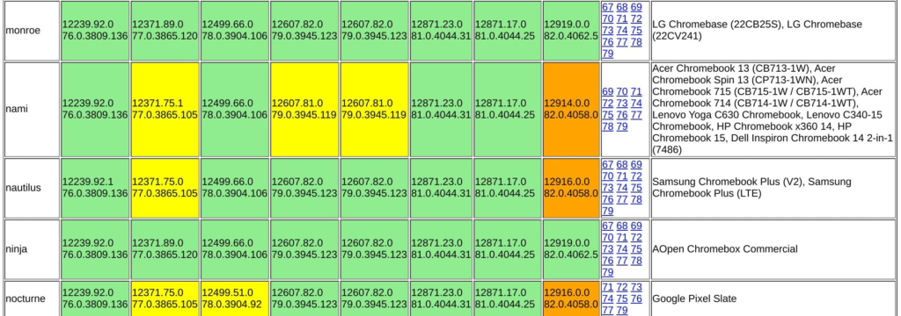
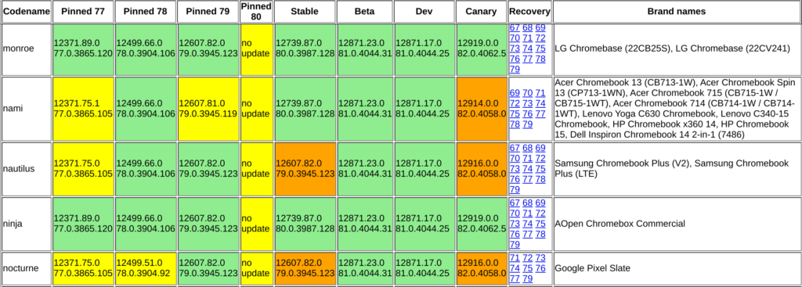
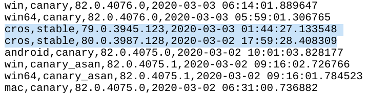
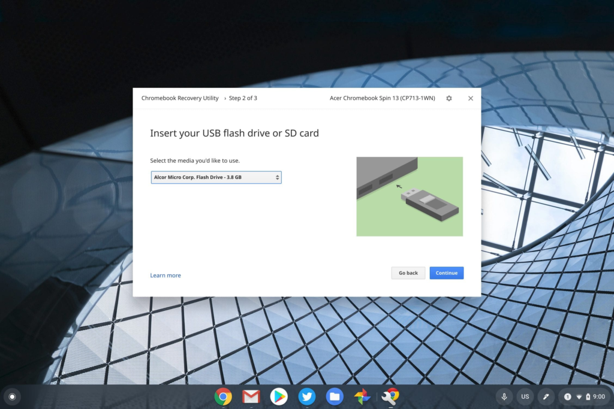

**Updated** **below**: As of right now if you check the [official list of Chrome OS versions for all supported devices](https://cros-updates-serving.appspot.com/), you'll see something different that you saw yesterday. The most current software is now back to Chrome OS 79 across the board, after [Chrome OS 80 was widely released yesterday](https://www.aboutchromebooks.com/news/chrome-os-80-stable-channel-arrives-heres-what-you-need-to-know/):

This morning

Yesterday

Clearly, something isn't quite right with Chrome OS 80 since Google pulled the update. Chrome OS 80 was available for roughly 8 hours, based on the timestamps of these version changes:

If you did the upgrade to Chrome OS 80 like I did, you won't be automatically reverted to 79. I'm researching to find out what showstopper issues might be in the software update. However, I did receive this tweet from Derek, indicating some issues he's already seeing.

https://twitter.com/derekberndt/status/1234827479732441088?s=20

I replied to Derek directly but I'll share that response here.

For those on Chrome OS 80, you can go back to Chrome OS 79 if you'd like but it's a manual process. You'll have to use the [Chrome OS Recovery tool](https://chrome.google.com/webstore/detail/chromebook-recovery-utili/jndclpdbaamdhonoechobihbbiimdgai/RK%3D2/RS%3DUI2uA8SxDAwF_T9oPb4YviZFT3Y-) with a USB stick or memory card and download the firmware for Chrome OS 79. Using the tool, you can then install the prior version. [This is why I always carry a USB stick with me](https://www.aboutchromebooks.com/news/why-every-chromebook-owner-should-carry-a-usb-key-or-sd-card-with-them/).

I'm choosing _not_ to do this, and frankly, I don't recommend it for most people. Chances are that Google will resolve this issue in a relatively timely manner with a new Chrome OS 80 version. I'm not sure it's worth the time and effort for the manual recovery unless there's a specific bug that has a major impact on your Chromebook use.

_**Update at 2:44pm ET 3/3/2020:**_ 17 hours (almost to the second) after the release was pulled, Chrome OS 80 is again available and rolling out to all supported devices. Given the timestamp between the versions, I suspect there wasn't any major software issues, but instead, this was due to the release being accidentally reverted. Regardless, it's available again!
