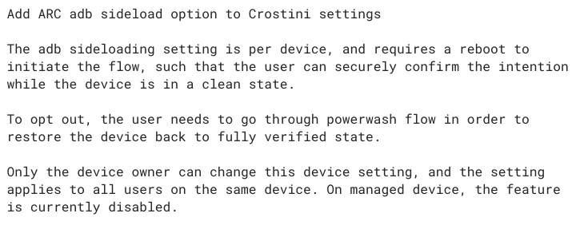
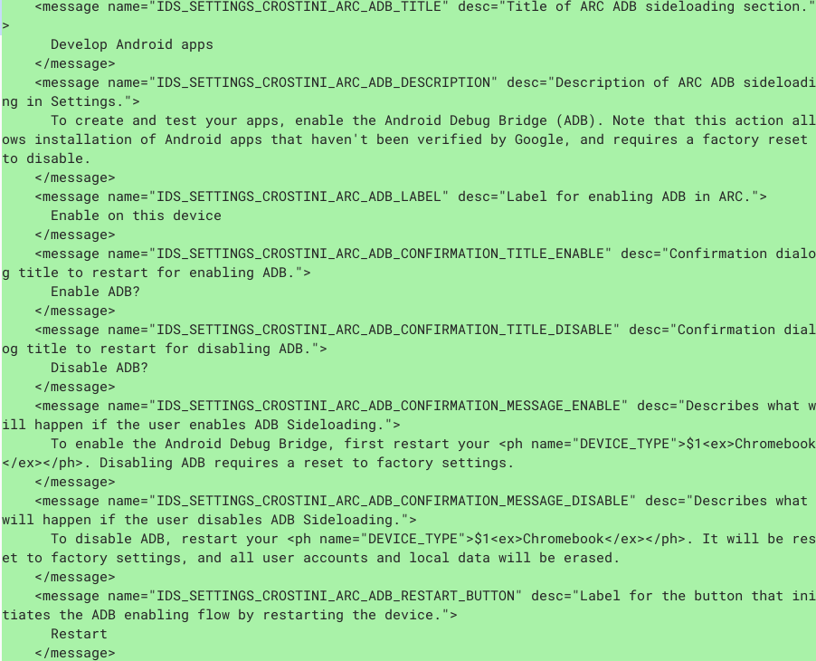

**Update: See clarification of how I expect this to work below the post.**

Like many of you, I've been tracking [a feature request to sideload Android apps on Chromebooks for more than two years](https://bugs.chromium.org/p/chromium/issues/detail?id=761329). And finally, this feature is coming soon: Likely with Chrome OS 80 to be exact.

Oddly, I _didn't_ find this out by the bug from September of 2017. Instead, I noticed earlier this week [a non-public bug](https://bugs.chromium.org/p/chromium/issues/detail?id=893332) as well as corresponding code changes that will bring the sideloading of Android apps to the Android container on Chromebooks.

Here's the change description:

While this feature is under development, it will require a special command when starting the Crostini container; you'll need to add _\--enable-features=ArcAdbSideloading_ when starting Linux from the command line on a Chromebook.

Eventually, I'd expect this to be a typical flag setting. And of course, as noted in the change description, this can be disabled or enabled by policy on managed Chromebooks. This is the internal message listing that further explains how it will look from an end-user standpoint:

Once the feature arrives, you should be able to install Android apps from sources _other_ than the Google Play Store.

Obviously there are risks involved, so most Chromebook users won't want to do this. However, there are plenty of Android apps not yet compatible with Chromebooks that I'd like to install and try.

And of course, this makes life easier for Android developers who are building their apps on a Chromebook using Android Studio.

Indeed, this specific feature was noted as coming with Chrome OS 80 earlier today at the [Android Dev Summit](https://developer.android.com/dev-summit), getting a solid round of applause. As it stands now, devs have to [connect an Android device via USB cable to a Chromebook](https://www.aboutchromebooks.com/news/chrome-os-75-adds-usb-device-adb-android-support-linux-project-crostini/) and then push their app to the device for testing or use Chrome OS Developer Mode, neither of which is ideal.

**_Update on 10/24/2019 at 10:30am PT:_**

Just to clarify how I expect Android app sideloading to work based on the screenshots and mention of the upcoming feature at the Android Dev Summit, which is a developer-focused event.

Sideloading apps won't likely be done as it is today for end-users on their Android devices, i.e.: by allowing app installs through Unknown Sources. Instead, since it's meant for developers to test their apps directly in the Android container of a Chromebook, it would work through Android Studio, so not an easy method for most end users. This likely explains why there are two similar, but separate, bugs / feature requests for Android app sideloading.
