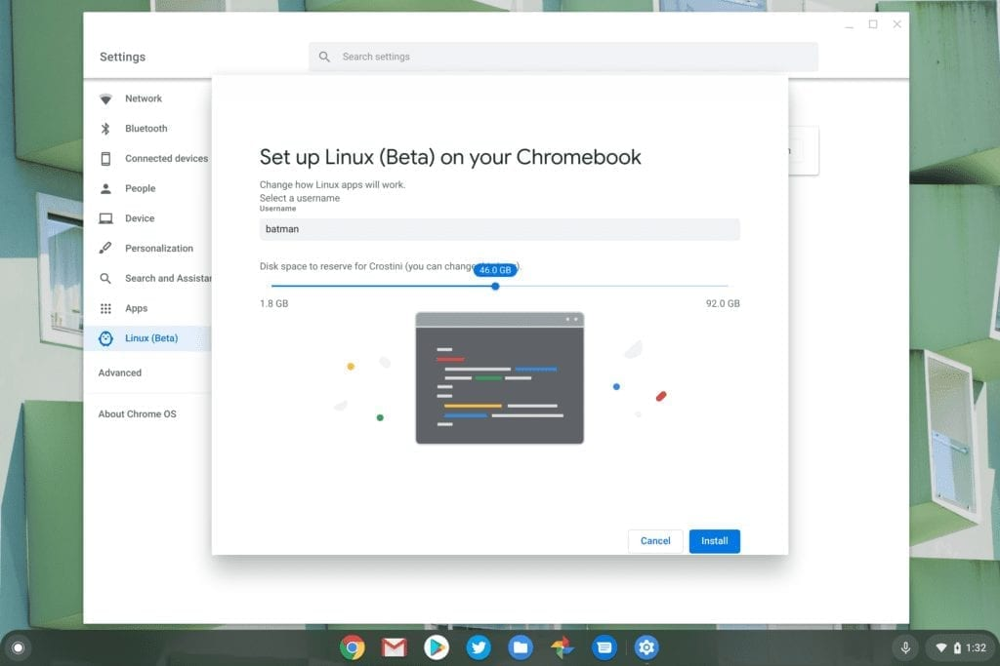

Chrome OS 81 is shaping up to be a pretty hefty release when it arrives on the Stable Channel on or around March 24. You don't have to wait that long to try some of the latest features though, provided you're feeling adventurous. The Chrome Releases Blog doesn't yet show this but [Chrome OS 81 Dev Channel version 81.0.4037.0 was released yesterday](https://omahaproxy.appspot.com/) and it enabled three key features for Linux on Chromebooks.

I upgraded to this version on a Google Pixel Slate and briefly tested the trio of functions, which include the [Debian Buster release of Linux](https://www.aboutchromebooks.com/news/linux-debian-10-buster-upgrade-chromebooks-chrome-os-project-crostini-how-to/), as well as [disk resizing](https://www.aboutchromebooks.com/news/linux-disk-resizing-on-chromebooks-pushed-back-to-chrome-os-81/) and [choice of username for the Linux container](https://www.aboutchromebooks.com/news/chrome-os-81-to-allow-linux-username-selection-for-crostini/).

If you want to follow me down the rabbit hole with this release on your own Chromebook, keep in mind that the Dev Channel can be unstable and you will likely see bugs. Additionally, you may lose data through a Chromebook powerwash when switching to or from the Dev Channel.

Having said that disclaimer, if you choose to enable the Dev Channel and install Chrome OS 81.0.4037.0, you'll first need to enable an experimental flag for each of these features, as shown:

You'll notice right away in the first flag that only new Linux, aka: Crostini, containers will use Debian Buster. If you have a current Linux container running Debian Stretch, it won't be upgraded at this time. Since this is a testing device for me, I simply disabled Linux on the Pixel Slate, rebooted and then enabled Linux.

I then verified that I had Debian Buster installed.

Note that you won't see any visual differences between Stretch and Buster on a Chromebook as there's no Linux desktop environment. Instead, you're getting the new features and functionality added to the new release.

When I set up the new Linux container, I was able to successfully choose my username and the amount of local storage allocated to Linux as well. I told you earlier this week what username I was planning to use and I kept my word!

Note that the lowest amount of storage I could dedicate to Linux is 1.8 GB. For very minimal use or for a Chromebook with limited storage, that's enough to get you going with a few apps installed.

In my case, I'm using Android Studio, Visual Code and a few other developer tools that can easily need 4 to 6 GB of storage. I chose to use half of my storage for Linux as a result.

After the resizing choice, I verified the storage allocation in the Chrome OS Files app and sure enough, it's spot on.

While all of these new features are aimed at Linux users on Chromebooks, there should be other additions and fixes for everyone in Chrome OS 81, including the [improved pairing experience for a Bluetooth mouse and keyboard](https://www.aboutchromebooks.com/news/chrome-os-81-to-improve-pairing-experience-for-your-bluetooth-keyboard-and-mouse/).

And by the time Chrome OS 81 rolls out, we should have our first reviews with the new [Asus Chromebook Flip C436](https://www.aboutchromebooks.com/news/asus-chromebook-flip-c436-specifications-release-date-price-ces-2020/) and [Samsung Galaxy Chromebook](https://www.aboutchromebooks.com/news/samsung-galaxy-chromebook-hands-on-yes-its-as-nice-as-it-looks/), as both are due to hit retail shelves in the coming weeks.
