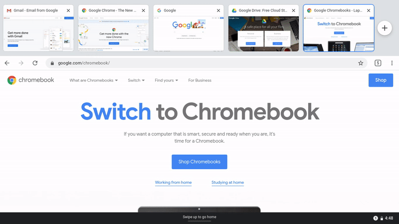
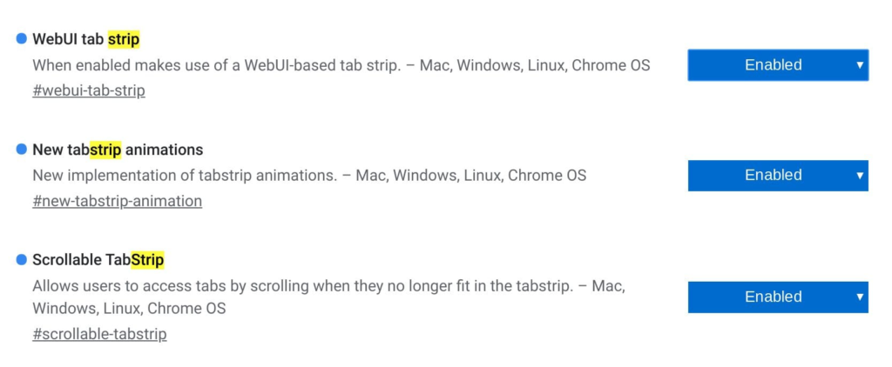
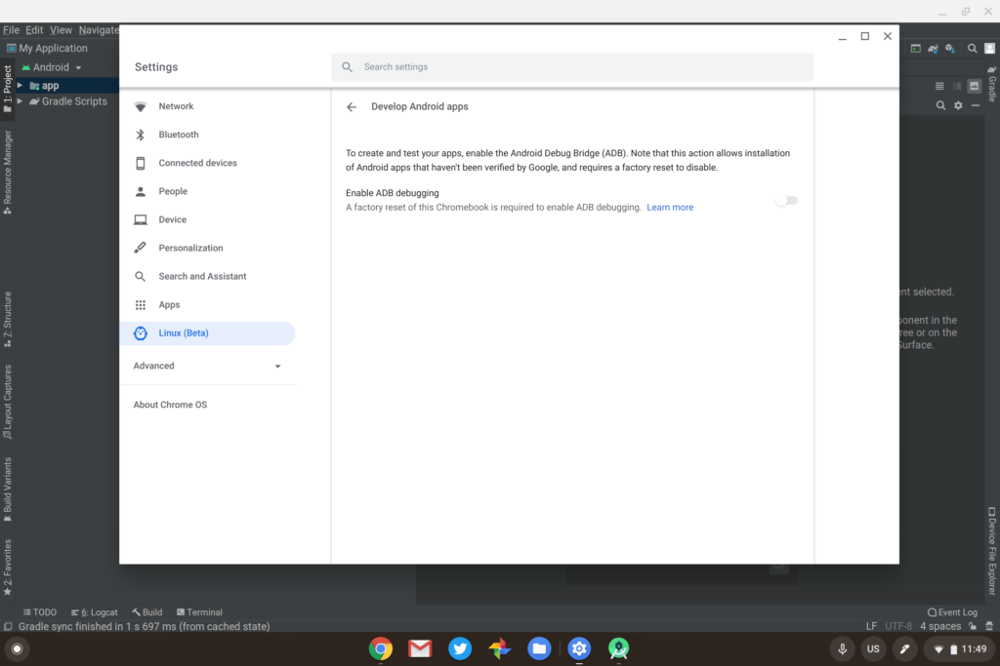
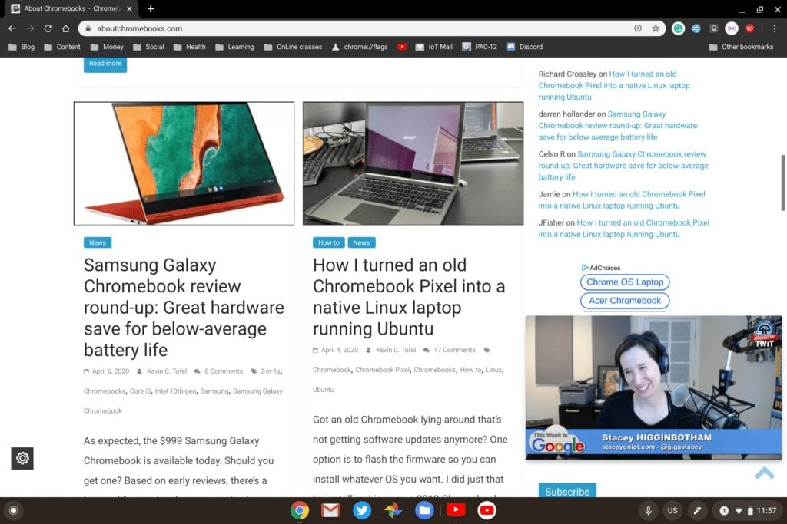
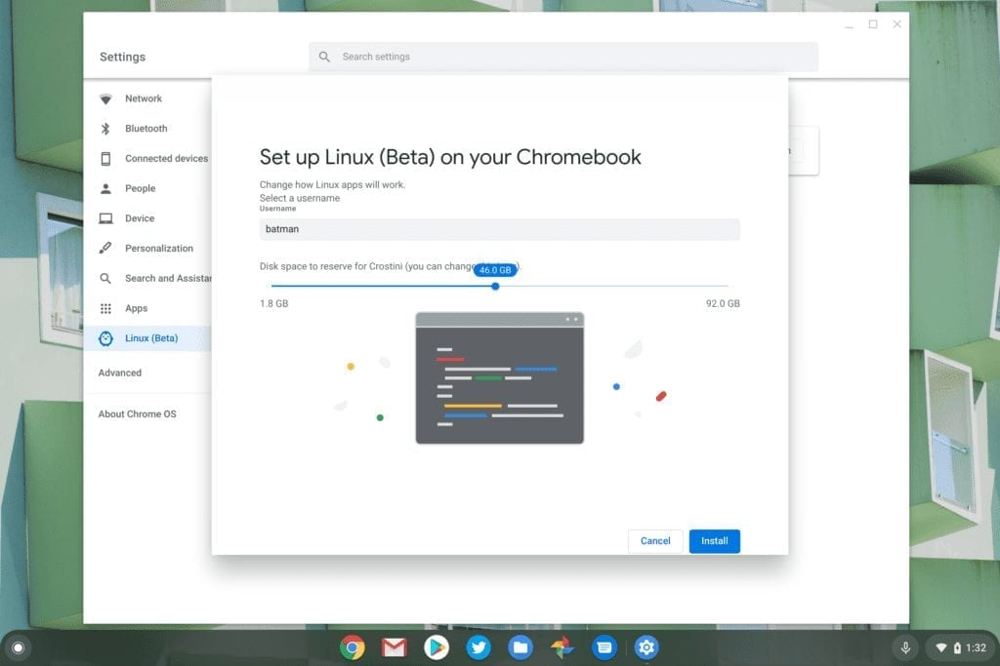

Although [Google's Chrome Releases Blog](https://chromereleases.googleblog.com/) hasn't yet announced it at the time of writing, Chrome OS 81 is now widely available for Chromebooks, with a few exceptions. You can check the Chrome Updates matrix for your specific device model, but the majority of Chromebooks now have Chrome OS 81.0.4044.94 available on the Stable Channel.

[Google did this week announce some new Chrome OS features specific to tablet mode navigation](https://blog.google/products/chromebooks/whats-new-april2020/), however, and some of them are in the Chrome OS 81 software update.

For example, swiping up from the bottom of a Chromebook in tablet mode opens the Launcher in full screen. Google calls this the "home screen" as it essentially shows all of your available apps.

A bottom-up swipe and hold now brings up Overview mode, showing all currently open applications. Also included are left and right swipes from the display edge to go forward or back on a web page. And like iPad OS, you can swipe up a little from the bottom to see the Shelf.

And although Google says this next feature will first arrive on the upcoming Lenovo Duet Chromebook, expected in May, [the new Tab Switching strip can be used now if you enable these flags](https://www.aboutchromebooks.com/news/chrome-os-80-adding-a-tab-strip-tablet-optimized-interface-to-chromebooks/):

Once the flags are enabled and the browser is restarted it should show a plus sign and a small up arrow at the top right; tapping plus opens a new tab while tapping the arrow brings the new tablet-optimized overview mode.

## Other items in Chrome OS 81 worth noting

Starting with this version FTP will no longer be "directly supported". Google says to use an FTP client instead, so I'm assuming FTP through the browser is what's going away.

[Developers using Android Studio now get the integrated support to locally deploy their Android app](https://www.aboutchromebooks.com/news/chrome-os-81-to-bridge-the-android-container-and-android-studio-for-easier-sideloads-on-chromebooks/) within Chrome OS:

> Android developers using Linux for Chromebooks (aka Crostini) can now build apps with Android Studio and test them natively on their Chromebook using Chrome OS’s built-in Android runtime (ARC++). This feature can be turned on from Linux settings

Note that while I used to be able to enable ADB debugging for this, the option is grayed out for me. I'll be researching that.

Since I can't test any Android apps, I have time to watch online content. And with Chrome OS 81, some Google Play Store apps, such as YouTube, Netflix, and Prime Video, now support picture-in-picture. No luck with YouTube TV, unfortunately, but at least I can catch up on This Week in Google, as shown below.

You can resize the floating window and there's no special action needed for the PIP support, simply minimize the app.

I almost forgot that with Chrome OS 81, all new Linux containers will use Debian Buster, not the older Debian Stretch version. If you still have a Stretch container, that will be upgraded in a coming release. And [if you enable these flags, you can resize the Linux container as well as choose a custom Linux username](https://www.aboutchromebooks.com/news/chrome-os-81-dev-channel-adds-buster-upgrade-linux-disk-resizing-custom-username-chromebook/):

There's also the traditional [slew of bug fixes in Chrome OS 81, which you can find here](https://bugs.chromium.org/p/chromium/issues/list?can=1&q=os=chrome%20M=81%20status=Fixed&colspec=ID+Pri+M+Stars+ReleaseBlock+Cr+Status+Owner+Summary+OS+Modified&groupby=&sort=&x=m&y=releaseblock&cells=tiles). Note that there will not be a Chrome OS 82 software update. [Google is skipping that version and jumping over to Chrome OS 83](https://www.aboutchromebooks.com/news/chromebook-release-dates-chrome-os-81-83/), which is now expected to hit Chromebooks in a Stable Chanel version on May 26
