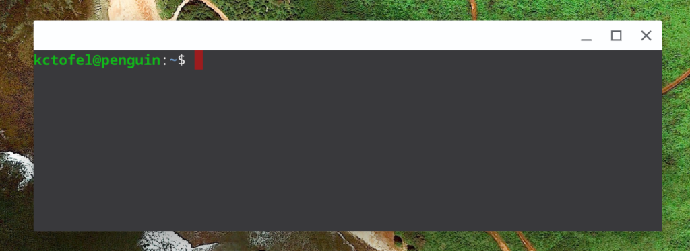

I'm not judging but _apparently_, some Chromebook users have some strange email addresses. And by strange, I mean they don't allow you to set up the default user when installing Linux in Chrome OS.

I'm joking a little here. However, this is a real issue for certain Gmail addresses because it's that account that's used to create the default user.

For example, my gmail account is kctofel@gmail.com and so my user account for Linux on my Chromebook is kctofel.

All the way back in December of 2018 [a bug was opened up for this issue](https://bugs.chromium.org/p/chromium/issues/detail?id=914515):

> A user report indicates that usernames starting with a digit don't work correctly; it looks like at least Debian's version of useradd recommends that usernames start with a lowercase letter or underscore, but I'm not sure what the exact rules are or where they are enforced.
> 
> Another user reported that their 'mail@example.com' username didn't work (presumably it conflicts with the standard 'mail' user).

I'm sure there a very few users overall affected by this but there's good news for them, and for anyone else who wants to have a custom username for Linux on a Chromebook: Chrome OS 81 should have a fix.

I may choose "batman" so I can be batman@penguin.

Based on the current code merge, when starting the Linux installation process, users will be prompted to supply a username, which is then applied to the Linux container system settings.

In typical fashion, this feature will be experimental and hidden behind a flag. You'll want to look for chrome://flags#crostini-username when the functionality is first rolled out, currently on track for Chrome OS 81.
