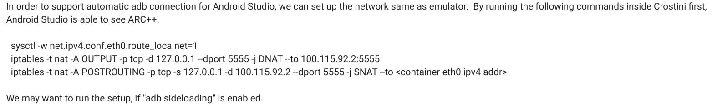

I've previously reported that with [early builds of Chrome OS 80, you can sideload Android apps not found in the Google Play Store](https://www.aboutchromebooks.com/news/chrome-os-80-how-to-sideload-android-apps-to-a-chromebook/) without putting your Chromebook in a less secure Developer Mode. Keep in mind that the functionality is [really meant for developers to test their own Android apps written in Android Studio on a Chromebook](https://www.aboutchromebooks.com/news/chrome-os-80-to-bring-arc-sideloading-of-android-apps-to-chromebooks/).

Currently, you have to run a command line to make this happen but [Chrome OS 81 will remove that requirement](https://bugs.chromium.org/p/chromium/issues/detail?id=1033095).

Essentially, the Chromium team is automating the command line procedures to make a connection between Android Studio and Android container used for Android apps.

Since opening up this connection could lead to potential security risks, there's been some team discussion on if this should be a default feature or not. It appears that the decision is yes but with a caveat: At first it will be hidden behind the flag _Crostini-Arc-Sideload_.

Again, this feature is developer focused, so the main benefit is for those who code in Android Studio on a Chromebook and want to test their app directly on the same device instead of connecting an Android handset to it.
