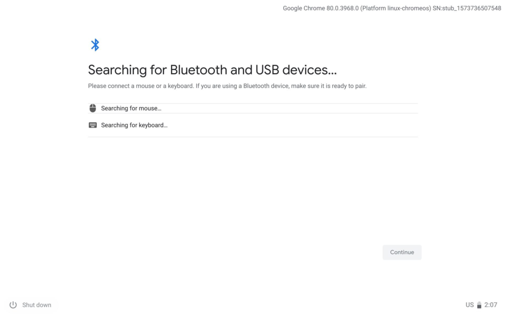
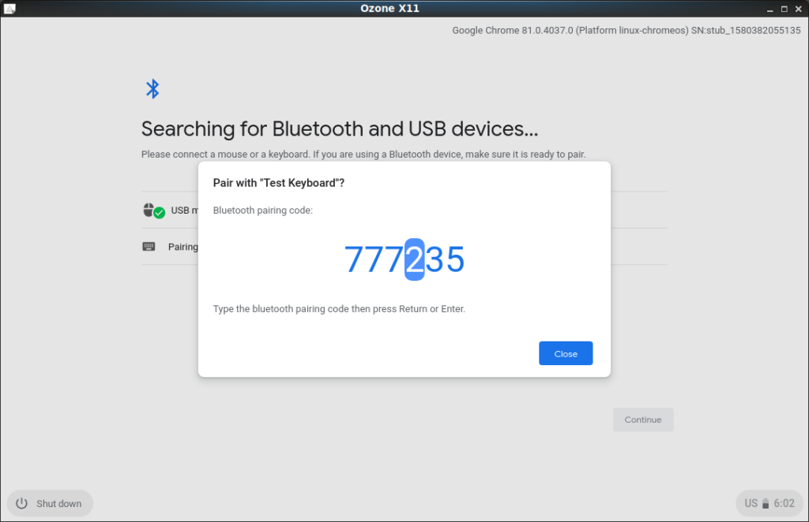

Lately, it seems like the Chrome OS team is making good headway on some really old bugs and features requests. Earlier this week a bug filed in 2018 for [Linux user name customization was squashed](https://www.aboutchromebooks.com/news/chrome-os-81-to-allow-linux-username-selection-for-crostini/) and now there's a feature request from the same year that looks ready for Chrome OS 81.

This one is for the "Bluetooth OOBE" or out of box experience so that [pairing either a Bluetooth keyboard or mouse to a Chromebook](https://bugs.chromium.org/p/chromium/issues/detail?id=852046) is similar to how it works on other computing platforms.

_Technically_, the Bluetooth HID profile stands for "Human Interface Device" and can also apply to joysticks and game controllers, or any other input device with buttons or sensors. However, there's no mention of any other Bluetooth devices other than a wireless mouse or keyboard.

Currently, adding a Bluetooth device via Chrome OS settings is pretty barebones. With the updated experience, targeted for the Chrome OS 81 release, it will appear more traditional:

Overall, this is more of a cosmetic feature, rather than a big functional upgrade, but it's good to see.

The more Chromebooks look and behave like traditional and yet modern devices -- without the legacy baggage, of course -- the easier it is for people to make the transition to Chrome OS.

On a related note, I'm not a big user of wireless peripherals with my Chromebooks and Pixel Slate. I do know that for a long time, people were having various Bluetooth issues with their devices though.

I'm curious: Are folks still experiencing those issues with Bluetooth on Chrome OS devices?
